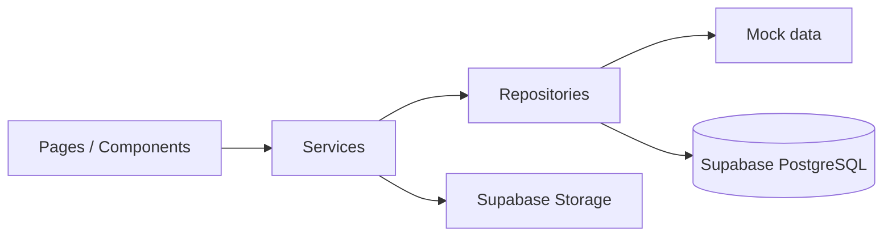

# Arquitectura — Arrendamientos MVP

## Objetivo
MVP demostrable para tesis, preparado para Supabase sin sobreingeniería.

## Stack
| Capa | Tecnología |
|------|------------|
| UI | Next.js App Router, React, Tailwind |
| Estado sesión demo | Context + cookie/local (mock) |
| Datos | Repositorios híbridos → Mock **o** Supabase (`config/app-mode.ts`) |
| Auth | Firebase Auth (identidad) |
| Persistencia | Supabase PostgreSQL (dominio) |
| Archivos | Supabase Storage — ver `services/file-storage.service.ts` |

## Estructura de carpetas
```
app/(dashboard)/     → rutas protegidas por layout (sidebar + topbar)
types/               → entidades y enums
lib/                 → supabase client, cn(), config
data/mock/           → datasets estáticos para desarrollo
repositories/        → interfaces + mock + supabase/ (repositorios reales)
services/            → API interna de la app
components/          → layout, ui, módulos
docs/database/       → schema SQL, seed, RLS, arquitectura persistencia
config/              → app-mode (MOCK | SUPABASE)
```

## Flujo de datos


## Cambio mock → Supabase
1. Crear proyecto Supabase y ejecutar `docs/database/supabase-schema.sql`.
2. Opcional: `docs/database/supabase-seed.sql` para datos demo.
3. Copiar `.env.example` → `.env.local` con URL y anon key.
4. `NEXT_PUBLIC_APP_MODE=SUPABASE` (o `NEXT_PUBLIC_USE_MOCK_DATA=false`).

Detalle en [docs/database/persistence-architecture.md](./database/persistence-architecture.md).

## Autenticación y roles

Login obligatorio en `/login` (credenciales mock + cookie `alquila_session`). Detalle en [AUTENTICACION.md](./AUTENTICACION.md).

- **ADMIN**: visión global, usuarios, todos los módulos.
- **ARRENDADOR**: inmuebles propios, contratos, pagos, servicios, mantenimiento, no renovación.
- **ARRENDATARIO**: dashboard reducido, pagos reportados, mantenimiento, no renovación.

## Entidades principales
`Usuario`, `Inmueble`, `Contrato`, `PagoReportado`, `ServicioPublico`, `Mantenimiento`, `NoRenovacion`

Cada entidad expone `id` (clave técnica) y `code` (código de negocio único, autogenerado en repositorios con prefijos `u-`, `inm-`, `ctr-`, `pag-`, `srv-`, `mnt-`, `nr-`). En formularios de creación no se muestra `code`; en tablas va como primera columna. Los selectores de relación muestran `code — título` (o `code — inmueble — título` en contratos).

## Decisiones
- Sin microservicios: todo en monolito Next.js + Supabase.
- Server Components para listados; Client Components para modales/formularios.
- Server Actions delgadas que delegan en `services/`.
