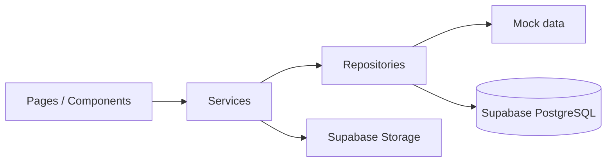

# Arquitectura — Arrendamientos MVP

## Objetivo
MVP demostrable para tesis, preparado para Supabase sin sobreingeniería.

## Stack
| Capa | Tecnología |
|------|------------|
| UI | Next.js App Router, React, Tailwind |
| Estado sesión demo | Context + cookie/local (mock) |
| Datos | Repositorios → Mock **o** Supabase |
| Auth futuro | Supabase Auth |
| Archivos | Supabase Storage (`comprobantes`, `contratos`, `mantenimiento`) |

## Estructura de carpetas
```
app/(dashboard)/     → rutas protegidas por layout (sidebar + topbar)
types/               → entidades y enums
lib/                 → supabase client, cn(), config
data/mock/           → datasets estáticos para desarrollo
repositories/        → interfaces + mock + supabase
services/            → API interna de la app
components/          → layout, ui, módulos
supabase/            → schema.sql, seed.sql
```

## Flujo de datos


## Cambio mock → producción
1. Crear proyecto Supabase y ejecutar `supabase/schema.sql`.
2. Copiar `.env.example` → `.env.local` con URL y keys.
3. `USE_MOCK_DATA=false` en entorno.
4. Opcional: ejecutar `supabase/seed.sql` para datos demo.

## Autenticación y roles

Login obligatorio en `/login` (credenciales mock + cookie `alquila_session`). Detalle en [AUTENTICACION.md](./AUTENTICACION.md).

- **ADMIN**: visión global, usuarios, todos los módulos.
- **ARRENDADOR**: inmuebles propios, contratos, pagos, servicios, mantenimiento, no renovación.
- **ARRENDATARIO**: dashboard reducido, pagos reportados, mantenimiento, no renovación.

## Entidades principales
`Usuario`, `Inmueble`, `Contrato`, `PagoReportado`, `ServicioPublico`, `Mantenimiento`, `NoRenovacion`

## Decisiones
- Sin microservicios: todo en monolito Next.js + Supabase.
- Server Components para listados; Client Components para modales/formularios.
- Server Actions delgadas que delegan en `services/`.
