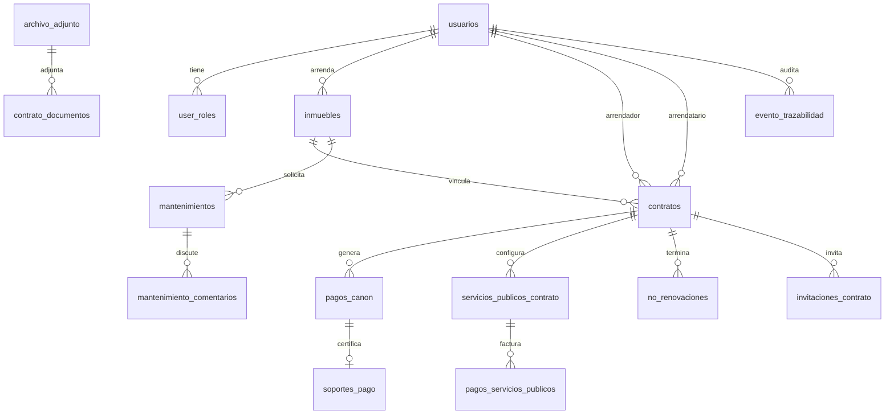

# Relaciones del modelo

## Diagrama ER (simplificado)

## FK y ON DELETE

| Relación | ON DELETE | Motivo |
|----------|-----------|--------|
| `inmuebles.arrendador_id → usuarios` | RESTRICT | No borrar arrendador con inmuebles |
| `contratos.inmueble_id → inmuebles` | RESTRICT | Contrato requiere inmueble válido |
| `contratos.arrendador_id → usuarios` | RESTRICT | Integridad contractual |
| `contratos.arrendatario_id → usuarios` | SET NULL | Contrato puede quedar sin arrendatario asignado |
| `pagos_canon.contrato_id → contratos` | CASCADE | Pagos dependen del contrato |
| `mantenimientos.inmueble_id → inmuebles` | CASCADE | Mantenimiento ligado al inmueble |
| `no_renovaciones.contrato_id → contratos` | CASCADE | Expediente depende del contrato |
| `evento_trazabilidad.contrato_id → contratos` | SET NULL | Conservar auditoría si se elimina contrato |
| `user_roles.usuario_id → usuarios` | CASCADE | Roles dependen del usuario |

## Índices clave

- Búsqueda por contrato: `idx_contratos_inmueble`, `idx_pagos_canon_contrato`
- Trazabilidad: `idx_trz_entidad`, `idx_trz_fecha`, `idx_trz_contrato`
- Inmuebles Bogotá: `idx_inmuebles_localidad`, `idx_inmuebles_arrendador`
- Archivos: `idx_archivo_adjunto_bucket_path`

## Archivos adjuntos

`archivo_adjunto` es la tabla central de metadatos. Las tablas puente (`contrato_documentos`, `mantenimiento_documentos`) vinculan archivos a entidades sin duplicar metadata.

En modo mock, `urlSimulada` reemplaza `bucket` + `path` + `publicUrl`.
