---
MANUAL TÉCNICO — VERSIÓN CONSOLIDADA
---

# AlquilaBogotá — Sistema de Gestión de Arrendamientos (MVP)

**Proyecto académico — Ingeniería de Software**

| Campo | Valor |
|-------|-------|
| Sistema | AlquilaBogotá MVP |
| Tipo | Prototipo demostrable (gestión de arrendamientos activos) |
| Stack | Next.js, React, Tailwind, Firebase Auth, Supabase PostgreSQL/Storage |
| Repositorio | [INSERTAR URL GITHUB] |
| Documento | Manual técnico consolidado para Notion / PDF |
| Origen | `docs/manual-tecnico/` |

---

## Índice

1. [Arquitectura general](#1-arquitectura-general)
2. [Requerimientos funcionales](#2-requerimientos-funcionales)
3. [Requerimientos no funcionales](#3-requerimientos-no-funcionales)
4. [Actores y roles](#4-actores-y-roles)
5. [Casos de uso de alto nivel](#5-casos-de-uso-de-alto-nivel)
6. [Casos de uso extendidos](#6-casos-de-uso-extendidos)
7. [Modelo relacional de la base de datos](#7-modelo-relacional-de-la-base-de-datos)
8. [Script de generación de la base de datos](#8-script-de-generación-de-la-base-de-datos)
9. [Diagrama de clases](#9-diagrama-de-clases)
10. [Diagramas de estado](#10-diagramas-de-estado)
11. [Diagramas de secuencia](#11-diagramas-de-secuencia)
12. [Diagramas de colaboración](#12-diagramas-de-colaboración)
13. [Diagrama de componentes](#13-diagrama-de-componentes)
14. [Diagrama de distribución](#14-diagrama-de-distribución)
15. [Gestión documental](#15-gestión-documental)
16. [Persistencia y almacenamiento](#16-persistencia-y-almacenamiento)
17. [Trazabilidad y auditoría](#17-trazabilidad-y-auditoría)
18. [Reportes](#18-reportes)
19. [Evidencias y pruebas E2E](#19-evidencias-y-pruebas-e2e)
20. [Código fuente en repositorio web](#20-código-fuente-en-repositorio-web)
21. [Conclusiones técnicas](#21-conclusiones-técnicas)

---

## Introducción técnica

El presente manual documenta el **MVP AlquilaBogotá**, aplicación web para la gestión integral de arrendamientos ya formalizados en Bogotá D.C. La documentación se elaboró a partir del **código fuente implementado** (tipos, servicios, repositorios, rutas App Router, esquema PostgreSQL y pruebas Playwright), sin incorporar funcionalidades no desarrolladas.

El sistema prioriza la **demostrabilidad académica**: arquitectura en capas (UI → Server Actions → Services → Repositories), autenticación con Firebase, persistencia intercambiable MOCK/Supabase, gestión documental en Storage, bitácora de trazabilidad y exportación PDF. Se excluyen explícitamente el procesamiento de pagos bancarios reales, la firma digital cualificada y el modelo marketplace.

> **Nota:** Donde se indique *implementación parcial*, el comportamiento está preparado o simulado para el prototipo y requeriría endurecimiento para producción.

---
## 1. Arquitectura general

Prototipo académico para gestión de **arrendamientos ya activos** (no marketplace). Monolito Next.js con persistencia intercambiable MOCK/Supabase.

---

## Vista por capas

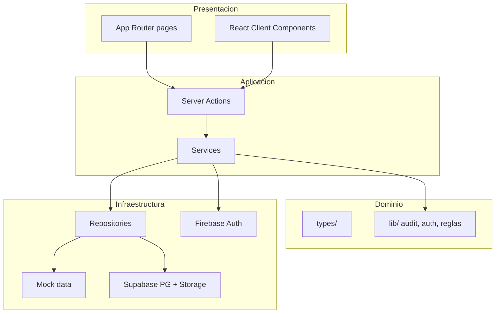

---

## Frontend

| Elemento | Implementación |
|----------|----------------|
| Framework | **Next.js** App Router (`app/`) |
| UI | **React** + **Tailwind CSS** |
| Patrón UI | Server Components para páginas; Client Components para modales, tablas interactivas, PDF |
| Rutas protegidas | `app/(dashboard)/` con layout sidebar + topbar |
| Rutas públicas | `/login`, `/onboarding`; API E2E `/api/e2e/login` |

Los componentes de módulo (`components/modules/*-module.tsx`) **no** importan repositorios; delegan en Server Actions.

---

## Backend ligero

No hay servidor Express separado. La lógica vive en:

- **`services/*.service.ts`** — reglas de negocio, autorización, trazabilidad, notificaciones.
- **`app/**/actions.ts`** — frontera del servidor; validación mínima y llamada a servicios.
- **`middleware.ts`** — cookie de sesión, redirecciones, `canAccessPath` por rol activo.

---

## Autenticación

| Modo | Descripción |
|------|-------------|
| **Producción / desarrollo normal** | **Firebase Authentication**; perfil en `profiles`; sincronización a `usuarios`. |
| **Pruebas E2E** | `E2E_MODE` + `POST /api/e2e/login` con perfiles demo (sin Google). |

Sesión de aplicación: cookie firmada (`lib/auth/session-token.ts`) con `rolActivo` y flags de onboarding.

---

## Persistencia

| Modo | Variable | Comportamiento |
|------|----------|----------------|
| **MOCK** (default) | `NEXT_PUBLIC_APP_MODE=MOCK` | Datos en memoria desde `data/mock/` |
| **SUPABASE** | `NEXT_PUBLIC_APP_MODE=SUPABASE` | PostgreSQL + Storage vía cliente Supabase |

Selector en `config/app-mode.ts`; fábrica en `repositories/index.ts` (`pick(mock, supabase)`).

---

## Archivos

- **Supabase Storage** con buckets por módulo (`lib/supabase/storage-paths.ts`).
- Metadatos en tabla `archivo_adjunto`.
- Servicios: `file-storage.service.ts`, `adjuntos-persistencia.service.ts`.
- En MOCK: `urlSimulada` sin bytes en la nube.

---

## Reportes PDF

- Librería **`@react-pdf/renderer`** (v4.x).
- Componentes en `components/pdf/` (reporte genérico, soporte de pago, no renovación).
- Descarga en cliente vía `PDFDownloadLink` (SSR deshabilitado donde aplica, p. ej. `dynamic(..., { ssr: false })`).

Los reportes agregan datos de múltiples repositorios y eventos de trazabilidad; **no** hay tabla `reportes` en BD.

---

## Pruebas

| Herramienta | Alcance |
|-------------|---------|
| **Playwright** | E2E en `tests/e2e/`; 25 pruebas (setup + login + flows + evidencias) |
| Config | `playwright.config.ts`; modo MOCK + E2E en `webServer` |

Detalle: `evidencias-pruebas.md` y `docs/PRUEBAS_E2E.md`.

---

## Patrón Services / Repositories

```
Component → Server Action → Service → Repository → (Mock | Supabase)
```

- **Service:** transacciones lógicas, permisos (`assertModuleAccess`, `access-control`), side effects (notificaciones, trazas).
- **Repository:** CRUD y consultas; implementación dual mock/supabase.

---

## Control de acceso

Doble barrera:

1. **Rutas:** `lib/auth/permissions.ts` + middleware (`rolActivo`).
2. **Datos:** `services/access-control.service.ts` filtra por contrato/inmueble/email.

> En Supabase, RLS actual es **demo permisiva**; la autorización efectiva del MVP está en servicios Node.

---

## Módulos funcionales (rutas)

| Ruta | Servicio principal |
|------|-------------------|
| `/` | `dashboard.service` |
| `/inmuebles` | `inmuebles.service` |
| `/contratos` | `contratos.service` |
| `/solicitudes-contrato` | `invitaciones-contrato.service` |
| `/pagos` | `pagos.service`, `soporte-pago.service` |
| `/servicios` | `servicios-contrato.service`, `pagos-servicio.service` |
| `/mantenimiento` | `mantenimiento.service`, `mantenimiento-economico.service` |
| `/no-renovacion` | `no-renovacion.service` |
| `/notificaciones` | `notificaciones.service` |
| `/trazabilidad` | `trazabilidad.service` |
| `/reportes` | `reportes.service` |
| `/usuarios` | `usuarios.service` |
| `/perfil` | `profile.service` |

---

## Límites del prototipo (arquitectura)

- Sin microservicios ni colas de mensajería.
- Sin procesamiento de pagos reales.
- Sin firma digital cualificada.
- Correo **simulado** (`email.service`, estado notificación `SIMULADA`).

---

## Documentación relacionada

| Documento | Ubicación |
|-----------|-----------|
| Arquitectura previa | `docs/ARQUITECTURA.md` |
| Persistencia | `docs/database/persistence-architecture.md` |
| Control de acceso | `docs/access-control.md` |
| E2E | `docs/PRUEBAS_E2E.md` |

---

## 2. Requerimientos funcionales

Documento derivado del código en `types/`, `services/`, `app/(dashboard)/`, `lib/auth/` y módulos React. Refleja la implementación actual (prototipo académico), no un marketplace ni procesamiento de pagos reales.

| Código | Nombre | Descripción | Actor principal | Módulos involucrados | Criterio de aceptación | Evidencia sugerida |
|--------|--------|-------------|-----------------|----------------------|------------------------|-------------------|
| **RF-01** | Autenticación, sesión y roles | Inicio de sesión con Firebase Authentication (producción/desarrollo) o login demo E2E; cookie de sesión firmada; onboarding de perfil; selección y cambio de **rol activo**; un usuario puede tener varios roles (`roles[]`). | Todos | `/login`, `/onboarding`, `/perfil`, `middleware.ts`, `services/auth.service.ts`, `services/profile.service.ts` | Usuario no autenticado redirige a `/login`; tras onboarding accede al dashboard; puede cambiar rol activo y ver menú acorde; rutas prohibidas redirigen a `/sin-acceso`. | Captura login/onboarding; prueba E2E `login.spec.ts`; evento `ROL_ACTIVO_CAMBIADO` en trazabilidad. |
| **RF-02** | Gestión de inmuebles | CRUD de inmuebles del arrendador (título, dirección, localidad Bogotá, canon, estado). Un inmueble no puede tener más de un contrato activo simultáneo. | Arrendador, Admin | `/inmuebles`, `services/inmuebles.service.ts` | Arrendador crea/edita solo sus inmuebles; Admin ve todos; códigos `inm-*` autogenerados. | `page-inmuebles`; captura `03-inmuebles.png`; tabla con filtros. |
| **RF-03** | Gestión de contratos | Crear y editar contratos sobre inmuebles propios: fechas, canon, reajuste, codeudor, depósito, inventario, documentos adjuntos, estados (`BORRADOR` → `PENDIENTE_CONFIRMACION` → `CONFIRMADO`, etc.). | Arrendador, Admin | `/contratos`, `services/contratos.service.ts` | Contrato vinculado a inmueble del arrendador; invitación generada al pasar a pendiente; documentos en Storage o mock. | `page-contratos`; captura `04-contratos.png`; adjuntos en bucket `contratos`. |
| **RF-04** | Invitación y confirmación de contrato | Invitación por email al arrendatario; aceptación o rechazo en `/solicitudes-contrato`; actualización de estado del contrato y notificaciones simuladas. | Arrendatario, Arrendador | `/solicitudes-contrato`, `services/invitaciones-contrato.service.ts` | Invitación `PENDIENTE` solo visible al email invitado; aceptar deja contrato `CONFIRMADO`; rechazar registra motivo. | `04b-solicitudes-contrato.png`; E2E solicitudes; trazabilidad `CONTRATO_ACEPTADO` / `CONTRATO_RECHAZADO`. |
| **RF-05** | Pagos de canon reportados | Arrendatario reporta pago mensual con monto, medio y comprobantes; arrendador valida o rechaza; opcional generación de soporte PDF y notificación simulada. **No hay pasarela de pago.** | Arrendatario, Arrendador | `/pagos`, `services/pagos.service.ts`, `services/soporte-pago.service.ts` | Pago creado en `REPORTADO`; validación → `VALIDADO`; comprobantes visibles en visor; soporte PDF descargable. | `05-pagos.png`; `11-visor-documentos.png`; E2E visor documentos. |
| **RF-06** | Servicios públicos | Arrendador configura servicios por contrato; arrendatario reporta pagos por periodo; arrendador valida/rechaza; estados incluyen `VENCIDO`. | Arrendador, Arrendatario | `/servicios`, `services/servicios-contrato.service.ts`, `services/pagos-servicio.service.ts` | Servicio activo por contrato; pago ligado a servicio y periodo; comprobantes en bucket `servicios`. | `06-servicios.png`; trazabilidad `PAGO_SERVICIO_*`. |
| **RF-07** | Mantenimiento | Solicitudes por inmueble, prioridad, tipo, responsabilidad compartida, comentarios, evidencias y cierre; flujo de estados y aceptación de responsabilidad por arrendatario. | Arrendatario, Arrendador | `/mantenimiento`, `services/mantenimiento.service.ts`, `services/mantenimiento-economico.service.ts` | Ticket `ABIERTO` → gestión → `RESUELTO`/`CERRADO`; adjuntos en `mantenimiento` bucket. | `07-mantenimiento.png`; eventos `MANTENIMIENTO_*`. |
| **RF-08** | No renovación | Expediente de no renovación por contrato: borrador, generación de documento/PDF, registro de envío y evidencias; marca contrato `noRenovar`. | Arrendador, Arrendatario | `/no-renovacion`, `services/no-renovacion.service.ts` | Estados `BORRADOR` → `DOCUMENTO_GENERADO` → `ENVIO_REGISTRADO`; PDF descargable; plazo de preaviso calculado. | `08-no-renovacion.png`; PDF `@react-pdf` en `components/pdf/no-renovacion-pdf.tsx`. |
| **RF-09** | Trazabilidad y auditoría | Bitácora append-only de eventos por entidad, usuario, contrato e inmueble; filtrado por control de acceso. | Admin, Arrendador | `/trazabilidad`, `services/trazabilidad.service.ts`, tabla `evento_trazabilidad` | Eventos registrados en acciones CRUD y cambios de estado; usuario solo ve eventos de su alcance. | `09-trazabilidad.png`; reporte `TRAZABILIDAD_GLOBAL`. |
| **RF-10** | Gestión documental | Carga de archivos vía `multi-file-uploader`, persistencia en Supabase Storage (modo SUPABASE) o URLs simuladas (MOCK); metadatos en `archivo_adjunto`; visor modal y descarga. | Todos (según módulo) | `services/file-storage.service.ts`, `services/adjuntos-persistencia.service.ts`, `components/shared/adjuntos-panel.tsx` | Archivo subido tras guardar entidad; listado y visor; trazabilidad `DOCUMENTO_ADJUNTADO`. | Storage buckets documentados; E2E visor; script `npm run check:storage`. |
| **RF-11** | Reportes | Generación de reportes estructurados y exportación PDF (`@react-pdf/renderer`): historial contrato/inmueble, estado de cuenta, cartera, etc. | Admin, Arrendador, Arrendatario | `/reportes`, `services/reportes.service.ts`, `types/reportes.ts` | Usuario con acceso genera reporte según catálogo `REPORTE_CATALOGO`; PDF descargable; evento `REPORTE_GENERADO`. | `10-reportes.png`; componente `reporte-download.tsx`. |
| **RF-12** | Administración y notificaciones | Admin gestiona usuarios mock/referencia; todos los roles consultan notificaciones simuladas del sistema (sin SMTP real en MVP). | Admin (usuarios); Todos (notificaciones) | `/usuarios`, `/notificaciones`, `services/usuarios.service.ts`, `services/notificaciones.service.ts` | Solo Admin accede a usuarios; notificaciones filtradas por email/contrato; estado `SIMULADA` tras registro. | Módulo usuarios; listado notificaciones; seed `data/mock/`. |

## Alcance explícitamente excluido (reglas de proyecto)

- Procesamiento de pagos reales o integración bancaria.
- Firma digital legalmente vinculante (solo adjuntar/descargar documentos).
- Marketplace o publicación de inmuebles para terceros no vinculados.

## Implementación parcial o preparada

| Aspecto | Estado |
|---------|--------|
| Row Level Security estricta en Supabase | Políticas demo permisivas (`mvp_demo_*`); reglas reales en `access-control.service.ts` |
| Envío de correo real | Simulado (`email.service.ts`, notificaciones `SIMULADA`) |
| Asignación rol ADMIN desde UI | No disponible; solo seed/configuración |
| Invitación `EXPIRADA` | Tipo definido; expiración automática no cronometrada en MVP |

## Referencias en código

- Permisos por módulo: `lib/auth/permissions.ts`
- Control de acceso por contrato/inmueble: `services/access-control.service.ts`
- Modo datos: `config/app-mode.ts` (`MOCK` \| `SUPABASE`)

---

## 3. Requerimientos no funcionales

Requerimientos derivados de decisiones de arquitectura, stack y código existente. Cada ítem indica el componente que materializa el criterio en esta versión.

| Código | Tipo | Descripción | Criterio de cumplimiento | Componente que lo soporta |
|--------|------|-------------|--------------------------|---------------------------|
| **RNF-01** | Seguridad | Autenticación obligatoria en rutas del dashboard; sesión en cookie firmada; validación de permisos por ruta y por recurso contractual. | Sin cookie válida → `/login`; ruta no permitida → `/sin-acceso`; acceso a contrato ajeno lanza `FORBIDDEN` y puede registrar `ACCESO_DENEGADO`. | `middleware.ts`, `lib/auth/session-token.ts`, `services/auth.service.ts`, `services/access-control.service.ts` |
| **RNF-02** | Usabilidad | Interfaz tipo SaaS con sidebar, tablas filtrables, badges de estado y modales CRUD. | Navegación por rol; `data-testid` en páginas y menú; feedback visual de estados. | `components/layout/`, `components/ui/`, módulos en `components/modules/` |
| **RNF-03** | Rendimiento | Monolito Next.js sin microservicios; listados vía Server Components; una instancia de worker en E2E. | Tiempos de carga aceptables en local; pruebas E2E timeout 90s global / 20s evidencias. | Next.js App Router, `playwright.config.ts` |
| **RNF-04** | Disponibilidad | Dependencia de servicios externos (Firebase, Supabase, hosting). | App funciona offline de datos solo en modo MOCK local; producción requiere disponibilidad de proveedores. | `config/app-mode.ts`, despliegue Vercel/Node documentado en arquitectura |
| **RNF-05** | Escalabilidad | Separación en capas services/repositories permite cambiar persistencia sin reescribir UI. | Nuevo backend = nuevos repositorios Supabase; UI consume mismos servicios. | `repositories/index.ts`, `repositories/supabase/` |
| **RNF-06** | Mantenibilidad | Tipos centralizados, enums alineados con SQL, trazas de auditoría unificadas. | Cambio de estado documentado en `types/index.ts` y `supabase-schema.sql`; eventos vía `trace-helper`. | `types/`, `lib/audit/`, `docs/database/` |
| **RNF-07** | Portabilidad | Aplicación Node.js estándar; variables de entorno para modo y credenciales. | Ejecutable con `npm run dev` / `npm run build` en Windows/Linux/macOS. | `package.json`, `.env.example` |
| **RNF-08** | Compatibilidad | Cliente web moderno; pruebas en Chromium (Playwright). | E2E pasa en Desktop Chrome profile; UI responsive con sidebar colapsable. | `playwright.config.ts`, Tailwind CSS |
| **RNF-09** | Trazabilidad | Registro de acciones de negocio y adjuntos en bitácora inmutable (append). | Toda operación crítica invoca `getTrazabilidadRepository().create` o helpers `trace*`. | `services/trazabilidad.service.ts`, `evento_trazabilidad` |
| **RNF-10** | Integridad de datos | FK en PostgreSQL; reglas de negocio (un contrato activo por inmueble, estados válidos). | Violación lanza `BusinessRuleError`; transiciones coherentes en servicios. | `services/contratos.service.ts`, `docs/database/supabase-schema.sql` |
| **RNF-11** | Almacenamiento documental | Archivos en buckets Supabase; metadatos en `archivo_adjunto` y tablas puente. | Upload con path estándar; lectura hidratada en repositorios Supabase. | `services/file-storage.service.ts`, `lib/supabase/storage-paths.ts`, buckets en `supabase-storage-setup.sql` |
| **RNF-12** | Auditoría | Eventos con actor (id, nombre, email, rol), estados anterior/nuevo y metadata JSON. | Consulta filtrada en `/trazabilidad` y reportes; accesos denegados auditados. | `types/trazabilidad.ts`, `lib/audit/actor.ts` |
| **RNF-13** | Respaldo/recuperación | **Implementación parcial:** responsabilidad de backups en Supabase/Firebase (proveedor). | Documentar que el MVP no incluye DR propio; seed SQL permite reinstalar datos demo. | `docs/database/supabase-seed.sql`, panel Supabase |
| **RNF-14** | Interoperabilidad | Identidad Firebase + dominio en PostgreSQL vinculado por `firebase_uid` / `profiles`. | Usuario autenticado sincroniza perfil con tabla `usuarios` vía `usuario-sync.service`. | `services/profile.service.ts`, `services/usuario-sync.service.ts` |
| **RNF-15** | Accesibilidad básica | Semántica HTML en formularios y navegación por teclado en componentes UI. | Labels en formularios de login y modales; contraste en tema dashboard. | `components/auth/login-form.tsx`, `components/ui/` |

## Notas de cumplimiento académico

- El MVP prioriza **demostrabilidad** sobre cumplimiento normativo completo (PCI, firma electrónica, etc.).
- RNF de seguridad en base de datos: RLS habilitada con políticas permisivas de demo; producción debe endurecer políticas (`docs/database/rls-strategy.md`).

---

## 4. Actores y roles

## Roles del sistema

El enum `Rol` en `types/index.ts` define: `ADMIN`, `ARRENDADOR`, `ARRENDATARIO`.

### Administrador (ADMIN)

| Aspecto | Detalle |
|---------|---------|
| **Descripción** | Superusuario del prototipo con visión global del arrendamiento gestionado en la plataforma. |
| **Permisos** | Crear, editar y eliminar en todos los módulos accesibles; gestión de usuarios; sin restricción por `arrendadorId` / contrato. |
| **Módulos visibles** | Dashboard, Inmuebles, Contratos, Pagos, Servicios, Mantenimiento, No renovación, Notificaciones, Solicitudes contrato, Usuarios y roles, Trazabilidad, Reportes, Perfil. |
| **Restricciones** | No se asigna desde la UI de perfil (solo datos seed o configuración). Debe completar onboarding si aplica perfil Firebase. |
| **Acciones principales** | Revisar operación completa, auditar trazabilidad, administrar usuarios de referencia, validar módulos en demo académica. |

### Arrendador (ARRENDADOR)

| Aspecto | Detalle |
|---------|---------|
| **Descripción** | Propietario o gestor de inmuebles que administra contratos, valida pagos y servicios, y gestiona mantenimiento y no renovación. |
| **Permisos** | CRUD inmuebles propios; CRUD contratos vinculados; validar/rechazar pagos de canon y servicios; configurar servicios públicos del contrato; gestionar mantenimiento; iniciar no renovación; generar reportes. |
| **Módulos visibles** | Dashboard, Inmuebles, Contratos, Pagos, Servicios, Mantenimiento, No renovación, Notificaciones, Trazabilidad, Reportes, Perfil. **No** ve Solicitudes contrato ni Usuarios (salvo rol activo distinto). |
| **Restricciones** | Solo datos donde `inmueble.arrendadorId` o `contrato.arrendadorId` coincide con su usuario; no elimina expedientes de no renovación (`canDelete` false). |
| **Acciones principales** | Publicar inmueble, crear contrato e invitar, validar comprobantes, cerrar tickets de mantenimiento, generar PDF de no renovación y reportes. |

### Arrendatario (ARRENDATARIO)

| Aspecto | Detalle |
|---------|---------|
| **Descripción** | Ocupante del inmueble bajo contrato confirmado; reporta pagos y participa en mantenimiento y no renovación. |
| **Permisos** | Crear pagos reportados y solicitudes de mantenimiento; editar solicitudes de contrato (aceptar/rechazar); crear expedientes de no renovación según reglas; consultar reportes de sus contratos. |
| **Módulos visibles** | Dashboard, Pagos, Servicios, Mantenimiento, No renovación, Notificaciones, **Solicitudes contrato** (etiqueta “Mis contratos / Solicitudes”), Reportes, Perfil. |
| **Restricciones** | Sin inmuebles ni contratos en menú si solo es arrendatario; si **no tiene contratos ni invitaciones pendientes**, se ocultan Pagos, Servicios, Mantenimiento, No renovación y Reportes (`sidebar.tsx` + `getNavAccessSummary`). No accede a Trazabilidad ni Usuarios. |
| **Acciones principales** | Aceptar/rechazar invitación, reportar canon y servicios con comprobante, comentar mantenimiento, aceptar responsabilidad compartida. |

## Roles múltiples y rol activo

> **Nota:** Un mismo usuario puede tener más de un rol (`Usuario.roles[]` y tabla `user_roles` / array `profiles.roles`). El sistema opera con un **rol activo** (`rolActivo` / `rol_activo`) que determina navegación, permisos de módulo (`lib/auth/permissions.ts`) y filtrado de datos (`rolEfectivo()` en servicios).

Flujo implementado:

1. **Onboarding** (`/onboarding`): el usuario elige uno o ambos roles operativos (ARRENDADOR / ARRENDATARIO).
2. **Perfil** (`/perfil`) y **topbar**: puede agregar roles adicionales (`add-role-modal.tsx`) y cambiar el rol activo sin repetir onboarding.
3. **Middleware**: usa `payload.rolActivo` con `canAccessPath()` para autorizar rutas.

La sincronización entre Firebase (`profiles`) y dominio (`usuarios`) se realiza en `services/usuario-sync.service.ts`.

## Matriz rápida módulo ↔ rol

| Módulo / Ruta | ADMIN | ARRENDADOR | ARRENDATARIO |
|---------------|:-----:|:----------:|:------------:|
| Dashboard | ✓ | ✓ | ✓ |
| Inmuebles | ✓ | ✓ | — |
| Contratos | ✓ | ✓ | —* |
| Solicitudes contrato | ✓ | — | ✓ |
| Pagos | ✓ | ✓ | ✓** |
| Servicios | ✓ | ✓ | ✓** |
| Mantenimiento | ✓ | ✓ | ✓** |
| No renovación | ✓ | ✓ | ✓** |
| Notificaciones | ✓ | ✓ | ✓ |
| Usuarios | ✓ | — | — |
| Trazabilidad | ✓ | ✓ | — |
| Reportes | ✓ | ✓ | ✓** |
| Perfil | ✓ | ✓ | ✓ |

\* Arrendatario puro no ve menú Contratos; gestiona vínculo vía Solicitudes.  
\** Oculto si arrendatario sin contratos ni invitaciones pendientes.

## Referencias

- `docs/access-control.md`
- `services/access-control.service.ts`
- `lib/auth/permissions.ts`

---

## 5. Casos de uso de alto nivel

Identificador **CU-XX** alineado con módulos implementados en `app/(dashboard)/`.

| CU | Nombre | Actor | Propósito | Precondición | Resultado esperado |
|----|--------|-------|-----------|--------------|-------------------|
| CU-01 | Iniciar sesión | Usuario registrado | Acceder al sistema con identidad verificada. | Cuenta Firebase o perfil demo E2E configurado. | Sesión activa; redirección a dashboard u onboarding. |
| CU-02 | Completar perfil y roles | Usuario nuevo | Definir datos personales y roles iniciales. | Primera sesión sin `perfilCompletado`. | Perfil completo; acceso al dashboard según rol activo. |
| CU-03 | Cambiar rol activo | Usuario multirol | Operar la app con otro perfil funcional sin cerrar sesión. | Usuario con `roles.length > 1`. | Menú y datos filtrados según nuevo rol activo. |
| CU-04 | Gestionar inmuebles | Arrendador | Mantener catálogo de propiedades en arriendo. | Rol ARRENDADOR o ADMIN. | Inmueble creado/actualizado con código `inm-*`. |
| CU-05 | Gestionar contratos | Arrendador | Formalizar arrendamiento sobre un inmueble. | Inmueble disponible sin contrato activo conflictivo. | Contrato en estado coherente con documentos opcionales. |
| CU-06 | Responder invitación de contrato | Arrendatario | Aceptar o rechazar propuesta de arrendamiento. | Invitación `PENDIENTE` al email del usuario. | Contrato confirmado o rechazado; notificaciones registradas. |
| CU-07 | Reportar pago de canon | Arrendatario | Informar pago del mes con soporte. | Contrato `CONFIRMADO`. | Pago en estado `REPORTADO` con comprobantes. |
| CU-08 | Validar pago de canon | Arrendador | Confirmar o rechazar comprobante reportado. | Pago `REPORTADO` de su contrato. | Pago `VALIDADO` o `RECHAZADO`; soporte PDF opcional. |
| CU-09 | Configurar servicios del contrato | Arrendador | Definir cuentas de servicios públicos del arriendo. | Contrato confirmado. | Registros en `ServicioPublicoContrato` activos. |
| CU-10 | Reportar y validar pago de servicio | Arrendatario / Arrendador | Ciclo de comprobación de servicios públicos. | Servicio configurado y periodo definido. | Pago de servicio en estado terminal validado o rechazado. |
| CU-11 | Gestionar mantenimiento | Arrendatario / Arrendador | Atender necesidades del inmueble arrendado. | Inmueble accesible al usuario. | Ticket con historial, comentarios y evidencias. |
| CU-12 | Tramitar no renovación | Arrendador / Arrendatario | Documentar decisión de no prorrogar contrato. | Contrato vigente con datos formales. | Expediente con PDF y envío registrado. |
| CU-13 | Consultar trazabilidad | Admin / Arrendador | Auditar acciones sobre entidades. | Módulo trazabilidad permitido. | Listado de eventos filtrado por alcance. |
| CU-14 | Generar reporte | Usuario autorizado | Obtener informe PDF/HTML del negocio. | Acceso al contrato/inmueble del reporte. | Documento `ReporteDocumento` exportado. |
| CU-15 | Gestionar documentos adjuntos | Usuario del módulo | Cargar y consultar archivos de soporte. | Entidad guardada o flujo post-create upload. | Archivos en Storage/mock y visor operativo. |
| CU-16 | Consultar notificaciones | Todos | Ver alertas simuladas del sistema. | Sesión activa. | Listado de notificaciones del usuario. |
| CU-17 | Administrar usuarios | Admin | Revisar usuarios del prototipo. | Rol ADMIN. | Listado/edición según `usuarios.service`. |

## Relación con requerimientos funcionales

| CU | RF |
|----|-----|
| CU-01 – CU-03 | RF-01 |
| CU-04 | RF-02 |
| CU-05 | RF-03 |
| CU-06 | RF-04 |
| CU-07 – CU-08 | RF-05 |
| CU-09 – CU-10 | RF-06 |
| CU-11 | RF-07 |
| CU-12 | RF-08 |
| CU-13 | RF-09 |
| CU-14 | RF-11 |
| CU-15 | RF-10 |
| CU-16 | RF-12 (notificaciones) |
| CU-17 | RF-12 |

---

## 6. Casos de uso extendidos

Descripción alineada con `services/*.service.ts` y flujos de UI en `components/modules/`.

---

## CU-EXT-01 — Inicio de sesión y selección de rol

| Campo | Contenido |
|-------|-----------|
| **Actor principal** | Usuario (cualquier rol) |
| **Actores secundarios** | Firebase Auth; API E2E (solo pruebas) |
| **Descripción** | El usuario se autentica y, si tiene varios roles, selecciona el rol activo para la sesión de trabajo. |
| **Precondiciones** | Aplicación desplegada; credenciales Firebase válidas o `E2E_MODE=true` para demo. |
| **Flujo principal** | 1. Usuario abre `/login`. 2. Ingresa credenciales o pulsa botón demo E2E. 3. Sistema valida con Firebase o `POST /api/e2e/login`. 4. Se emite cookie `alquila_session`. 5. Si `perfilCompletado=false` → `/onboarding`; si no → `/`. 6. Usuario cambia rol activo desde topbar/perfil si aplica. |
| **Flujos alternos** | 3a. Token inválido → permanece en login. 5a. Onboarding: elige roles y completa datos → redirección dashboard. |
| **Postcondiciones** | Sesión firmada; `rolActivo` persistido en token/perfil. |
| **Excepciones** | Firebase no configurado en producción sin E2E; error de red. |
| **Entidades** | `Usuario`, `Profile`, evento `ROL_ACTIVO_CAMBIADO` / `ONBOARDING_COMPLETADO` |

---

## CU-EXT-02 — Crear inmueble

| Campo | Contenido |
|-------|-----------|
| **Actor principal** | Arrendador |
| **Actores secundarios** | — |
| **Descripción** | Registro de un inmueble con datos de ubicación (Bogotá), canon y estado inicial. |
| **Precondiciones** | Sesión ARRENDADOR o ADMIN; módulo inmuebles permitido. |
| **Flujo principal** | 1. Abre `/inmuebles`. 2. Crea registro vía modal. 3. `inmuebles.service` asigna `arrendadorId` y genera `code`. 4. Repositorio persiste. 5. Trazabilidad `CREADO` / `INMUEBLE_ACTUALIZADO`. |
| **Flujos alternos** | 2a. Edición de inmueble existente propio. |
| **Postcondiciones** | Inmueble `DISPONIBLE` (por defecto) en datastore. |
| **Excepciones** | `FORBIDDEN` si rol incorrecto. |
| **Entidades** | `Inmueble`, `EventoTrazabilidad` |

---

## CU-EXT-03 — Crear contrato e invitar arrendatario

| Campo | Contenido |
|-------|-----------|
| **Actor principal** | Arrendador |
| **Actores secundarios** | Sistema de notificaciones (simulado) |
| **Descripción** | El arrendador crea un contrato en borrador o pendiente, adjunta documentos y envía invitación al email del arrendatario. |
| **Precondiciones** | Inmueble propio sin contrato activo en estados `CONFIRMADO` o `PENDIENTE_CONFIRMACION`. |
| **Flujo principal** | 1. Crea contrato en `/contratos` con fechas, canon, email arrendatario. 2. Servicio valida unicidad por inmueble. 3. Estado → `PENDIENTE_CONFIRMACION` (según flujo). 4. Se crea `InvitacionContrato` con token y estado `PENDIENTE`. 5. Notificación `INVITACION_CONTRATO`. 6. Trazabilidad `INVITACION_ENVIADA`. |
| **Flujos alternos** | 3a. Permanece `BORRADOR` sin invitación. 4a. Sincroniza `arrendatarioId` si ya existe perfil con ese email. |
| **Postcondiciones** | Contrato e invitación persistidos; arrendatario ve solicitud en `/solicitudes-contrato`. |
| **Excepciones** | `BusinessRuleError` si inmueble ya tiene contrato activo. |
| **Entidades** | `Contrato`, `InvitacionContrato`, `ArchivoAdjunto`, `Notificacion` |

---

## CU-EXT-04 — Aceptar o rechazar contrato

| Campo | Contenido |
|-------|-----------|
| **Actor principal** | Arrendatario |
| **Actores secundarios** | Arrendador (notificado) |
| **Descripción** | Respuesta a invitación contractual. |
| **Precondiciones** | Invitación `PENDIENTE`; email coincide con sesión. |
| **Flujo principal (aceptar)** | 1. Lista invitaciones en solicitudes. 2. Acepta → `invitaciones-contrato.service`. 3. Invitación `ACEPTADA`. 4. Contrato `CONFIRMADO`, `arrendatarioId` asignado. 5. Notificaciones a ambas partes. 6. Trazabilidad `CONTRATO_ACEPTADO`. |
| **Flujo principal (rechazar)** | 3. Invitación `RECHAZADA` con motivo. 4. Contrato `RECHAZADO`. 5. Notificación y trazabilidad `CONTRATO_RECHAZADO`. |
| **Flujos alternos** | — |
| **Postcondiciones** | Estados terminales coherentes; menú del arrendatario habilita pagos/servicios. |
| **Excepciones** | Invitación no pertenece al usuario; invitación no pendiente. |
| **Entidades** | `InvitacionContrato`, `Contrato`, `Notificacion`, `EventoTrazabilidad` |

---

## CU-EXT-05 — Reportar pago de canon

| Campo | Contenido |
|-------|-----------|
| **Actor principal** | Arrendatario |
| **Actores secundarios** | Arrendador (notificado) |
| **Descripción** | Reporte mensual del canon con comprobantes adjuntos. |
| **Precondiciones** | Contrato accesible y confirmado; rol puede crear en módulo pagos. |
| **Flujo principal** | 1. Crea pago en `/pagos` (mes, monto, medio). 2. Adjunta comprobantes (pendientes hasta guardar o Storage). 3. `pagos.service` crea `PagoReportado` en `REPORTADO`. 4. Notificación `PAGO_REPORTADO`. 5. Trazabilidad `PAGO_REPORTADO` y adjuntos. |
| **Flujos alternos** | 2a. Modo MOCK: URLs simuladas; modo SUPABASE: upload post-create vía `file-storage.actions`. |
| **Postcondiciones** | Registro en `pagos_canon` / mock; comprobantes vinculados. |
| **Excepciones** | Solo arrendatario/admin puede reportar; contrato no permitido. |
| **Entidades** | `PagoReportado`, `ArchivoAdjunto`, `Notificacion` |

---

## CU-EXT-06 — Validar o rechazar pago de canon

| Campo | Contenido |
|-------|-----------|
| **Actor principal** | Arrendador |
| **Actores secundarios** | Arrendatario |
| **Descripción** | Revisión del comprobante y cambio de estado del pago. |
| **Precondiciones** | Pago en `REPORTADO`; contrato del arrendador. |
| **Flujo principal (validar)** | 1. Arrendador valida en tabla/modal. 2. Estado → `VALIDADO`, `validadoPorId`, fecha. 3. Opcional: genera `SoportePago` y PDF. 4. Notificación y trazabilidad `PAGO_VALIDADO` / `SOPORTE_GENERADO`. |
| **Flujo principal (rechazar)** | 2. Estado → `RECHAZADO` con motivo. 3. `PAGO_RECHAZADO`. |
| **Postcondiciones** | Pago en estado terminal; soporte opcional persistido. |
| **Excepciones** | Arrendatario no puede validar (salvo ADMIN). |
| **Entidades** | `PagoReportado`, `SoportePago`, `Notificacion` |

---

## CU-EXT-07 — Configurar servicios públicos del contrato

| Campo | Contenido |
|-------|-----------|
| **Actor principal** | Arrendador |
| **Descripción** | Alta/edición de servicios (energía, agua, gas, etc.) ligados al contrato. |
| **Precondiciones** | Contrato confirmado; acceso al contrato. |
| **Flujo principal** | 1. En `/servicios`, pestaña configuración. 2. Crea `ServicioPublicoContrato` (tipo, empresa, cuenta, periodicidad). 3. Trazabilidad `SERVICIO_CONTRATO_CREADO`. |
| **Flujos alternos** | Inactivar servicio → `SERVICIO_CONTRATO_INACTIVADO`. |
| **Postcondiciones** | Servicios listos para reporte de pagos por periodo. |
| **Entidades** | `ServicioPublicoContrato`, `Contrato`, `Inmueble` |

---

## CU-EXT-08 — Reportar y validar pago de servicio público

| Campo | Contenido |
|-------|-----------|
| **Actor principal** | Arrendatario (reportar); Arrendador (validar) |
| **Descripción** | Ciclo de pago de servicios con comprobante y vencimiento. |
| **Precondiciones** | Servicio activo; periodo definido. |
| **Flujo principal** | 1. Arrendatario reporta pago → `REPORTADO`. 2. Arrendador valida/rechaza → `VALIDADO`/`RECHAZADO`. 3. Sistema puede marcar `VENCIDO` según reglas de negocio. 4. Notificaciones y trazabilidad correspondientes. |
| **Postcondiciones** | `PagoServicioPublico` actualizado con comprobantes. |
| **Entidades** | `PagoServicioPublico`, `ServicioPublicoContrato`, `ArchivoAdjunto` |

---

## CU-EXT-09 — Crear solicitud de mantenimiento

| Campo | Contenido |
|-------|-----------|
| **Actor principal** | Arrendatario o Arrendador |
| **Descripción** | Apertura de ticket con prioridad, tipo y descripción. |
| **Precondiciones** | Acceso al inmueble (por contrato confirmado o propiedad). |
| **Flujo principal** | 1. Crea ticket en `/mantenimiento` estado `ABIERTO`. 2. Adjunta evidencias opcionales. 3. Notificación `MANTENIMIENTO_CREADO`. |
| **Postcondiciones** | `Mantenimiento` persistido. |
| **Entidades** | `Mantenimiento`, `ArchivoAdjunto` |

---

## CU-EXT-10 — Gestionar mantenimiento

| Campo | Contenido |
|-------|-----------|
| **Actor principal** | Arrendador (gestión); Arrendatario (aceptación responsabilidad) |
| **Descripción** | Cambio de estado, responsabilidad económica compartida, comentarios y cierre. |
| **Precondiciones** | Ticket existente. |
| **Flujo principal** | 1. Arrendador pasa a `EN_GESTION`. 2. Define responsabilidad/valores (`mantenimiento-economico.service`). 3. Arrendatario acepta/rechaza si `COMPARTIDO`. 4. Resolución → `RESUELTO`/`CERRADO` con documentos de cierre. |
| **Flujos alternos** | Rechazo de ticket → `RECHAZADO`. Comentarios → `ComentarioMantenimiento`. |
| **Postcondiciones** | Ticket cerrado con trazabilidad completa. |
| **Entidades** | `Mantenimiento`, `ComentarioMantenimiento`, `ArchivoAdjunto` |

---

## CU-EXT-11 — Generar no renovación

| Campo | Contenido |
|-------|-----------|
| **Actor principal** | Arrendador o Arrendatario (parte del contrato) |
| **Descripción** | Creación del expediente y generación del documento formal PDF. |
| **Precondiciones** | Contrato accesible; datos formales de partes. |
| **Flujo principal** | 1. Inicia expediente `BORRADOR`. 2. Completa motivo y partes. 3. Genera documento → `DOCUMENTO_GENERADO`. 4. Descarga PDF (`no-renovacion-pdf.tsx`). 5. Marca contrato `noRenovar`. |
| **Postcondiciones** | `NoRenovacion` con adjuntos de documento. |
| **Entidades** | `NoRenovacion`, `Contrato`, `ArchivoAdjunto` |

---

## CU-EXT-12 — Registrar evidencia de envío (no renovación)

| Campo | Contenido |
|-------|-----------|
| **Actor principal** | Usuario iniciador del expediente |
| **Descripción** | Registro del medio de envío y evidencias (guía, correo certificado simulado). |
| **Precondiciones** | Documento generado. |
| **Flujo principal** | 1. Registra medio, fecha y adjuntos de envío. 2. Estado expediente → `ENVIO_REGISTRADO`. 3. Trazabilidad `NO_RENOVACION_ENVIO_REGISTRADO`. |
| **Postcondiciones** | Evidencias en bucket `no-renovacion`; notificación registrada. |
| **Entidades** | `NoRenovacion`, `ArchivoAdjunto` |

---

## CU-EXT-13 — Consultar trazabilidad

| Campo | Contenido |
|-------|-----------|
| **Actor principal** | Admin o Arrendador |
| **Descripción** | Consulta filtrada de eventos de auditoría. |
| **Precondiciones** | Módulo permitido. |
| **Flujo principal** | 1. Abre `/trazabilidad`. 2. Servicio aplica `filterTrazabilidadEvents`. 3. Muestra tabla con acción, entidad, usuario, fechas. |
| **Postcondiciones** | Solo eventos autorizados visibles. |
| **Entidades** | `EventoTrazabilidad` |

---

## CU-EXT-14 — Generar reporte

| Campo | Contenido |
|-------|-----------|
| **Actor principal** | Usuario con acceso al módulo reportes |
| **Descripción** | Construcción de `ReporteDocumento` y descarga PDF. |
| **Precondiciones** | Filtros válidos (contrato/inmueble según tipo). |
| **Flujo principal** | 1. Selecciona tipo en catálogo `REPORTE_CATALOGO`. 2. `reportes.service` agrega datos y eventos. 3. Render PDF cliente con `@react-pdf/renderer`. 4. `REPORTE_GENERADO` en trazabilidad. |
| **Postcondiciones** | PDF descargado; sin tabla `reportes` persistida (generación on-demand). |
| **Entidades** | `ReporteDocumento` (DTO), `EventoTrazabilidad`, entidades fuente |

---

## CU-EXT-15 — Cargar y consultar documentos

| Campo | Contenido |
|-------|-----------|
| **Actor principal** | Usuario del módulo origen |
| **Actores secundarios** | Supabase Storage |
| **Descripción** | Subida diferida post-creación de entidad, listado y visor modal. |
| **Precondiciones** | Permiso sobre entidad; modo SUPABASE con buckets configurados o MOCK. |
| **Flujo principal** | 1. Usuario selecciona archivos en `multi-file-uploader`. 2. Al guardar entidad, `subirYVincular` en server actions. 3. Metadatos en `archivo_adjunto`. 4. Consulta vía `VerAdjuntosButton` / `adjuntos-panel`. 5. Trazabilidad `DOCUMENTO_ADJUNTADO`. |
| **Flujos alternos** | MOCK: `urlSimulada` sin bytes reales en Storage. |
| **Postcondiciones** | Archivos consultables en visor; path en bucket si SUPABASE. |
| **Excepciones** | Fallo de upload Storage; entidad sin permiso. |
| **Entidades** | `ArchivoAdjunto`, entidad dueña (Pago, Contrato, etc.) |

---

## 7. Modelo relacional de la base de datos

Fuente: `docs/database/supabase-schema.sql` (alineado con `types/index.ts`).

> **Nota:** Los reportes (`ReporteDocumento`) **no** se persisten en tabla dedicada; se generan on-demand en `services/reportes.service.ts`.

---

## Tablas de identidad y roles

| Tabla | PK | FK principales | Propósito |
|-------|-----|----------------|-----------|
| `usuarios` | `id` (text) | — | Usuario de dominio del MVP; roles, contacto, `firebase_uid`, soft delete `deleted_at` |
| `user_roles` | `id` (uuid) | `usuario_id` → `usuarios` | Relación N:M usuario–rol (`app_rol`) |
| `profiles` | `id` (text) | — | Perfil vinculado a Firebase Auth; array `roles`, onboarding |

---

## Inmuebles y contratos

| Tabla | PK | FK principales | Propósito |
|-------|-----|----------------|-----------|
| `inmuebles` | `id` | `arrendador_id` → `usuarios` | Propiedad en arriendo (ubicación Bogotá, canon, estado) |
| `contratos` | `id` | `inmueble_id`, `arrendador_id`, `arrendatario_id` | Arrendamiento: fechas, canon, estados, codeudor, no renovación |
| `invitaciones_contrato` | `id` | `contrato_id` → `contratos` | Invitación al arrendatario (`token_invitacion`, estado texto) |

---

## Documentos

| Tabla | PK | FK principales | Propósito |
|-------|-----|----------------|-----------|
| `archivo_adjunto` | `id` | `contrato_id`, `inmueble_id`, `uploaded_by` (opc.) | Metadatos de archivos en Storage (bucket, path, public_url) |
| `contrato_documentos` | `id` (uuid) | `contrato_id`, `archivo_id` | Puente contrato ↔ adjuntos |

---

## Pagos

| Tabla | PK | FK principales | Propósito |
|-------|-----|----------------|-----------|
| `pagos_canon` | `id` | `contrato_id`, `reportado_por_id`, validadores | Pagos de canon reportados (`estado_pago`) |
| `soportes_pago` | `id` | `pago_id`, `contrato_id`, arrendador/arrendatario | Soporte formal tras validación (`numero_soporte` único) |
| `servicios_publicos_contrato` | `id` | `contrato_id`, `inmueble_id` | Configuración de servicios por contrato |
| `pagos_servicios_publicos` | `id` | `servicio_publico_contrato_id`, `contrato_id` | Pagos por periodo de servicios (`estado_pago_servicio`) |

---

## Mantenimiento

| Tabla | PK | FK principales | Propósito |
|-------|-----|----------------|-----------|
| `mantenimientos` | `id` | `inmueble_id`, `solicitado_por_id` | Tickets de mantenimiento |
| `mantenimiento_comentarios` | `id` | `mantenimiento_id`, `inmueble_id`, `usuario_id` | Hilo de comentarios |
| `mantenimiento_documentos` | `id` (uuid) | `mantenimiento_id`, `archivo_id` | Evidencias y cierre documental |

---

## No renovación, notificaciones, auditoría

| Tabla | PK | FK principales | Propósito |
|-------|-----|----------------|-----------|
| `no_renovaciones` | `id` | `contrato_id`, `inmueble_id` | Expediente JSON (`datos`) + `estado_no_renovacion` |
| `notificaciones` | `id` | `contrato_id` (opc.) | Cola simulada de alertas al usuario |
| `evento_trazabilidad` | `id` | `contrato_id`, `inmueble_id`, `pago_id`, `usuario_afectado_id` | Bitácora de auditoría (acción, estados, JSON metadata) |

---

## Enumeraciones PostgreSQL

| Enum | Valores (resumen) |
|------|-------------------|
| `app_rol` | ADMIN, ARRENDADOR, ARRENDATARIO |
| `estado_contrato` | BORRADOR, PENDIENTE_CONFIRMACION, CONFIRMADO, RECHAZADO, CANCELADO, TERMINADO, VENCIDO |
| `estado_inmueble` | DISPONIBLE, ARRENDADO, MANTENIMIENTO |
| `estado_pago` | REPORTADO, VALIDADO, RECHAZADO |
| `estado_pago_servicio` | PENDIENTE, REPORTADO, VALIDADO, RECHAZADO, VENCIDO |
| `estado_mantenimiento` | ABIERTO, EN_GESTION, RESUELTO, CERRADO, RECHAZADO |
| `estado_no_renovacion` | BORRADOR, PENDIENTE_GENERACION, DOCUMENTO_GENERADO, ENVIO_REGISTRADO, ANULADA |
| `tipo_mantenimiento` | LOCATIVO, ESTRUCTURAL, … |
| `tipo_responsabilidad` | ARRENDADOR, ARRENDATARIO, COMPARTIDO, POR_DEFINIR |

---

## Relaciones principales (cardinalidad)

```
usuarios 1 ── * inmuebles (arrendador)
inmuebles 1 ── * contratos
usuarios 1 ── * contratos (arrendador / arrendatario opcional)
contratos 1 ── * invitaciones_contrato
contratos 1 ── * pagos_canon
contratos 1 ── * servicios_publicos_contrato
servicios_publicos_contrato 1 ── * pagos_servicios_publicos
pagos_canon 1 ── 0..1 soportes_pago
inmuebles 1 ── * mantenimientos
mantenimientos 1 ── * mantenimiento_comentarios
contratos 1 ── 0..1 no_renovaciones (vía contrato.no_renovacion_id en app)
archivo_adjunto * ── vinculado por entidad_tipo + entidad_id (polimórfico)
evento_trazabilidad * ── contexto opcional contrato / inmueble / pago
```

---

## Índices relevantes

- `idx_inmuebles_arrendador`, `idx_contratos_arrendador`, `idx_contratos_arrendatario`
- `idx_pagos_canon_contrato`, `idx_pagos_servicio_contrato`
- `idx_trz_entidad`, `idx_trz_fecha`, `idx_archivo_adjunto_entidad`

---

## Seguridad en base de datos

RLS **habilitada** en tablas principales con políticas demo `mvp_demo_*` (acceso total para prototipo). Estrategia de endurecimiento: `docs/database/rls-strategy.md`.

---

## 8. Script de generación de la base de datos

El MVP centraliza los scripts SQL en `docs/database/`. No ejecutar en producción sin revisar credenciales y políticas RLS.

---

## `docs/database/supabase-schema.sql`

| Aspecto | Detalle |
|---------|---------|
| **Propósito** | Crear el esquema completo en PostgreSQL (Supabase): enums, tablas, índices, triggers `updated_at`, habilitación RLS y políticas demo permisivas. |
| **Cuándo usarlo** | Primera configuración del proyecto Supabase o recreación del modelo en SQL Editor. |
| **Contenido clave** | Tablas `usuarios`, `profiles`, `inmuebles`, `contratos`, pagos, mantenimiento, `no_renovaciones`, `notificaciones`, `evento_trazabilidad`, `archivo_adjunto`; comentario final sobre buckets Storage. |
| **Relación con la app** | Tipos en `types/index.ts` y repositorios `repositories/supabase/*` mapean columnas snake_case ↔ camelCase. |

**Orden recomendado:** ejecutar este archivo antes que seed y storage setup.

---

## `docs/database/supabase-seed.sql`

| Aspecto | Detalle |
|---------|---------|
| **Propósito** | Poblar datos de demostración académica (usuarios, inmuebles, contratos, pagos, etc.) coherentes con `data/mock/seed.ts`. |
| **Cuándo usarlo** | Tras el schema, para tener dataset visible en modo `NEXT_PUBLIC_APP_MODE=SUPABASE`. |
| **Precaución** | Solo entornos de desarrollo/demo; puede sobrescribir o duplicar si se ejecuta múltiples veces sin limpiar. |

---

## `docs/database/supabase-storage-setup.sql`

| Aspecto | Detalle |
|---------|---------|
| **Propósito** | Documentar y/o ejecutar configuración de **buckets** en Supabase Storage: `contratos`, `pagos`, `servicios`, `mantenimiento`, `no-renovacion`, `evidencias`. |
| **Cuándo usarlo** | Al activar subida real de comprobantes y documentos (`services/file-storage.service.ts`). |
| **Complemento** | `docs/database/storage-buckets.md`, script `npm run check:storage` para verificar conectividad. |

---

## Scripts relacionados (no sustitutos)

| Archivo | Nota |
|---------|------|
| `docs/database/supabase-rls-demo.sql` | Políticas RLS adicionales si el schema ya se aplicó sin la sección final. |
| `supabase/schema.sql` / `supabase/seed.sql` | Copias o enlaces del repo; preferir `docs/database/` como fuente documentada. |
| `data/mock/seed.ts` | Seed en memoria para modo MOCK (no SQL). |

---

## Flujo de configuración típico

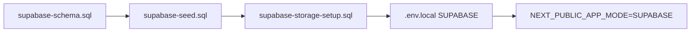

1. Crear proyecto en [Supabase](https://supabase.com).
2. Ejecutar **schema** en SQL Editor.
3. Ejecutar **seed** (opcional).
4. Crear buckets según **storage-setup** y políticas de Storage.
5. Configurar variables en `.env.local` (ver `.env.example`).
6. Cambiar modo de app a SUPABASE y reiniciar Next.js.

---

## Verificación

- `npm run check:supabase` — conectividad y tablas.
- `npm run check:storage` — buckets y permisos de subida.

Documentación ampliada: `docs/database/CONEXION_SUPABASE.md`, `docs/database/persistence-architecture.md`.

---

## 9. Diagrama de clases

Diagrama del dominio según `types/index.ts`, `types/trazabilidad.ts` y `types/reportes.ts`.

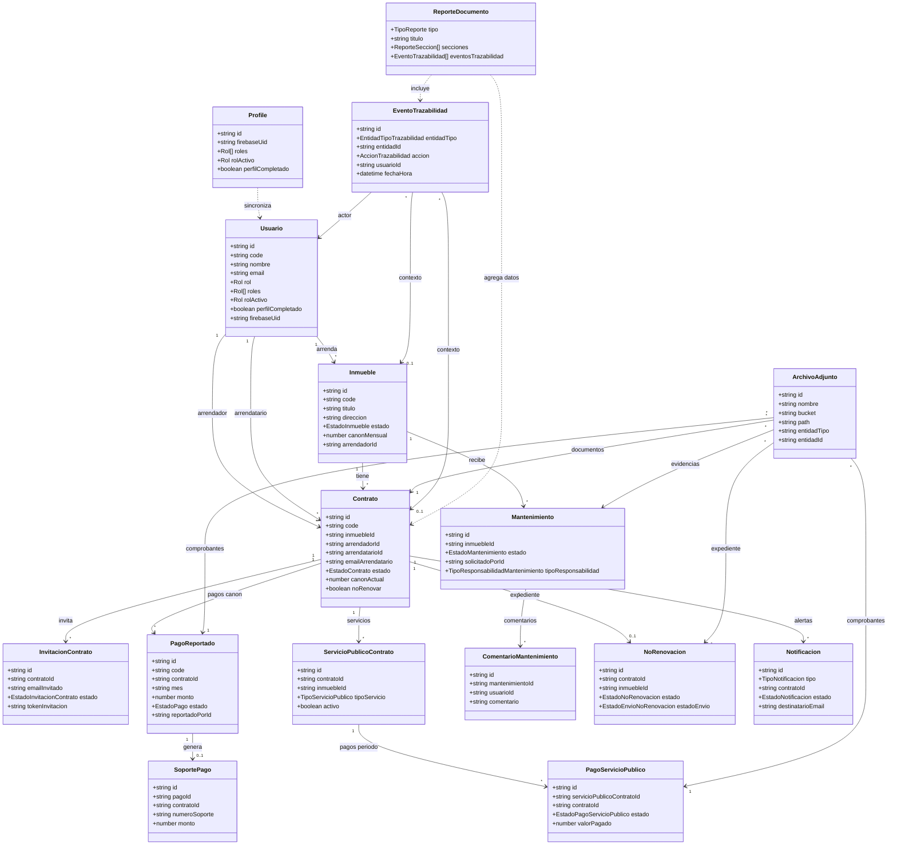

---

## 10. Diagramas de estado

Estados definidos en `types/index.ts` y enums PostgreSQL en `docs/database/supabase-schema.sql`.

---

## Contrato (`EstadoContrato`)

El contrato gobierna el ciclo de vida del arrendamiento. Transiciones principales vía `contratos.service` e `invitaciones-contrato.service`.

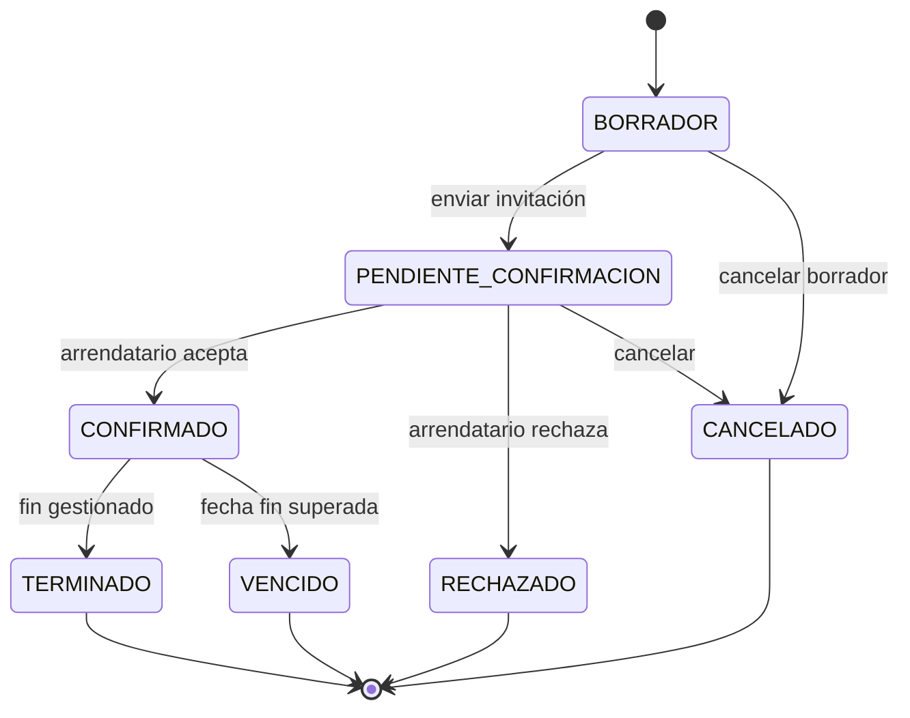

**Explicación:** `BORRADOR` permite editar sin compromiso; `PENDIENTE_CONFIRMACION` espera respuesta de invitación; `CONFIRMADO` habilita pagos y servicios. Estados terminales cierran el ciclo operativo.

---

## Invitación de contrato (`EstadoInvitacionContrato`)

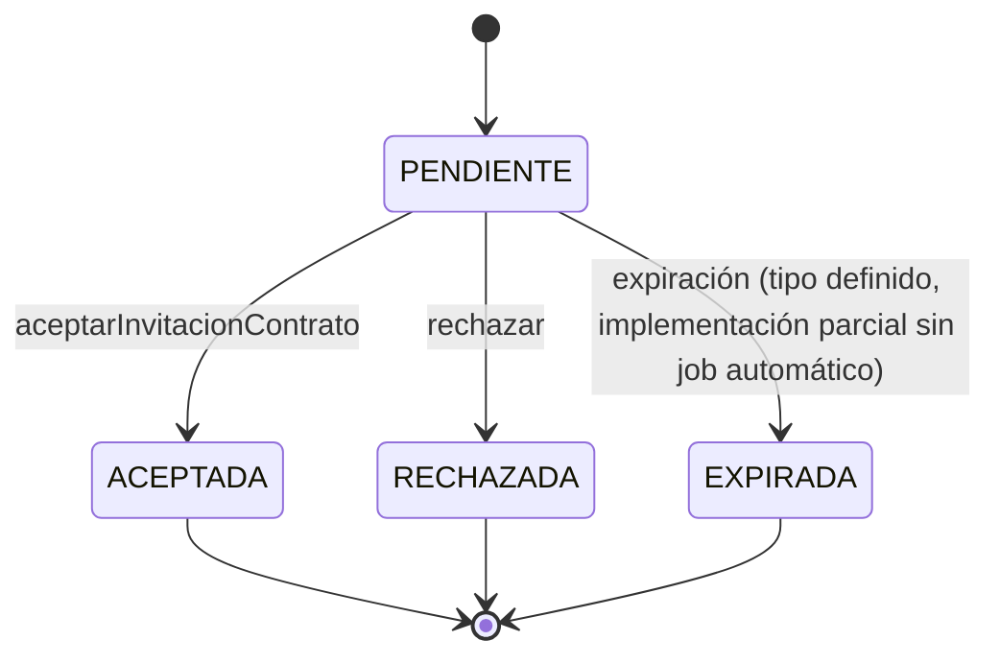

**Explicación:** Una invitación pendiente bloquea la confirmación hasta respuesta del arrendatario con email coincidente.

---

## Pago de canon (`EstadoPago` / `PagoReportado`)

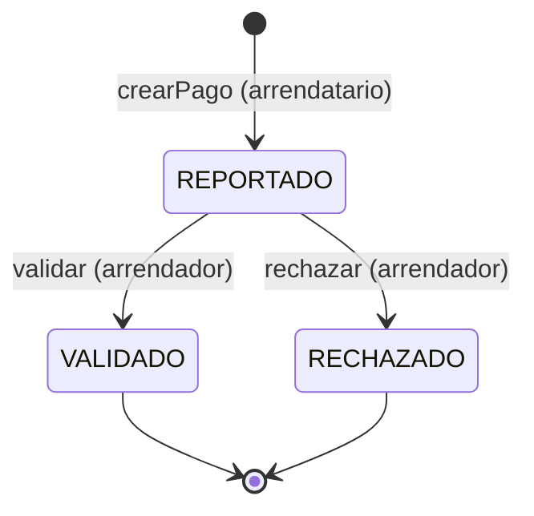

**Explicación:** No existe pasarela de pago; `REPORTADO` indica declaración del arrendatario; el arrendador certifica con `VALIDADO` y puede emitir `SoportePago` PDF.

---

## Pago de servicio público (`EstadoPagoServicioPublico`)

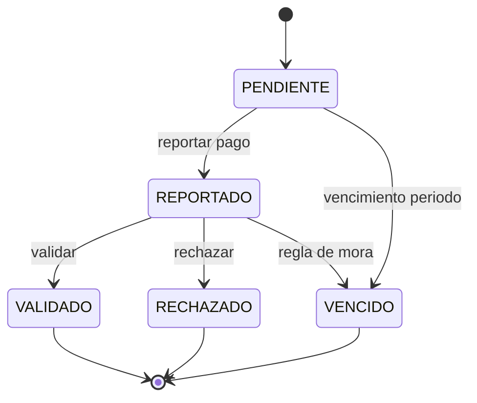

**Explicación:** Incluye estado inicial `PENDIENTE` antes del reporte del arrendatario; `VENCIDO` alerta mora en servicios.

---

## Mantenimiento (`EstadoMantenimiento`)

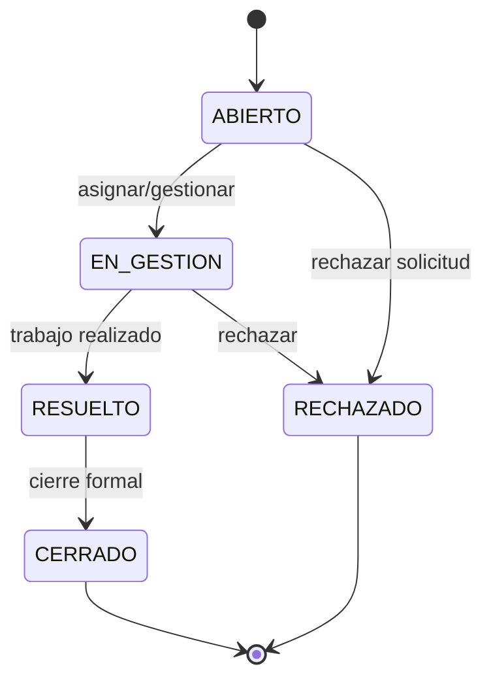

**Explicación:** Paralelamente puede existir subestado de **aceptación de responsabilidad** (`AceptacionResponsabilidadMantenimiento`: PENDIENTE, ACEPTADA, RECHAZADA) para reparto de costos.

---

## No renovación (`EstadoNoRenovacion`)

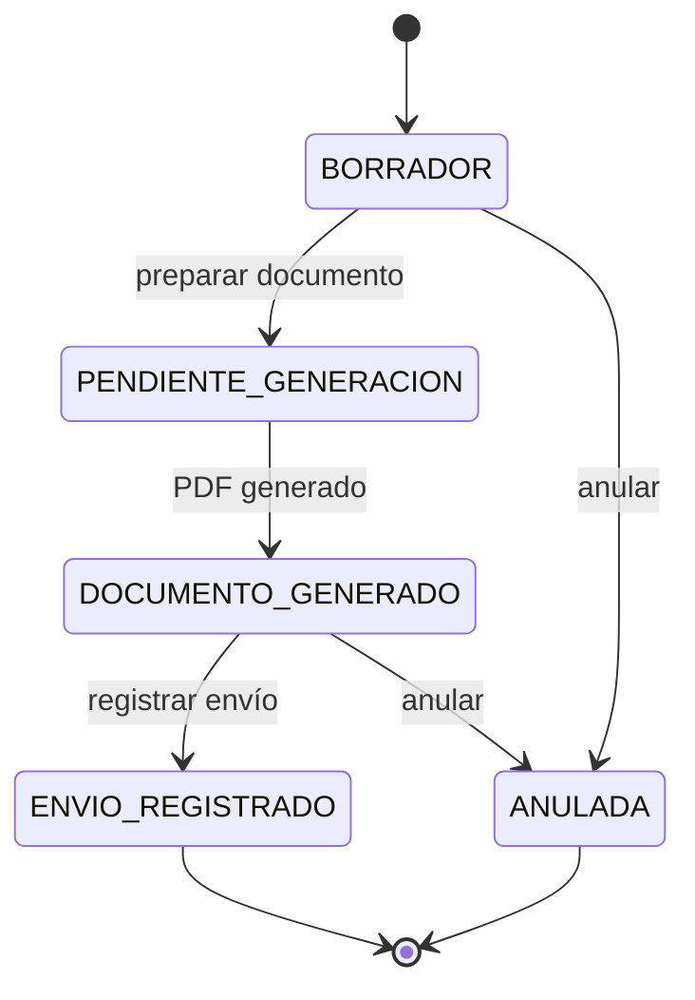

**Explicación:** El expediente acumula adjuntos de documento y de envío; el contrato puede marcarse `noRenovar` en paralelo.

**Envío (`EstadoEnvioNoRenovacion`):** `PENDIENTE` → `REGISTRADO` (o `ERROR` en fallos simulados).

---

## Notificación (`EstadoNotificacion`)

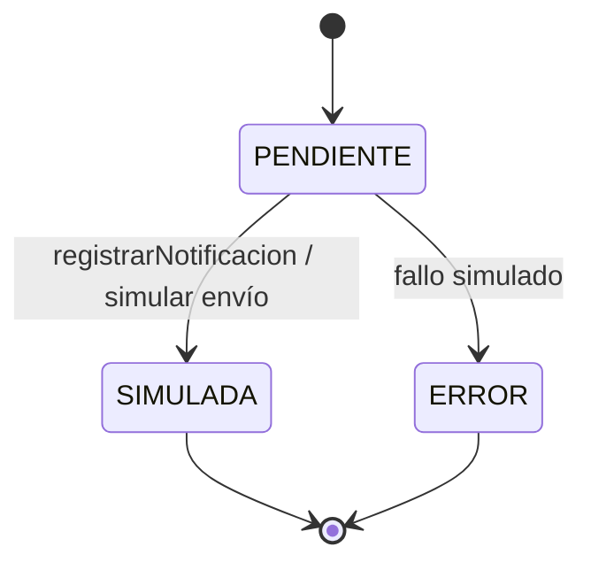

**Explicación:** Las notificaciones no salen por SMTP real en el MVP; `SIMULADA` documenta el acto para la demo.

---

## Evento de trazabilidad

Los eventos **no cambian de estado**; son registros append-only. Se modelan como:

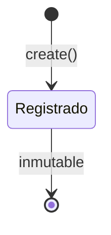

**Explicación:** La “transición” es la creación del evento con `accion`, `estadoAnterior` y `estadoNuevo` opcionales reflejando cambios en otras entidades.

---

## 11. Diagramas de secuencia

Interacción entre UI (Next.js), Server Actions, servicios, repositorios y servicios externos. Patrón común: **no acceso directo a datos desde componentes**.

---

## Crear contrato e invitar arrendatario

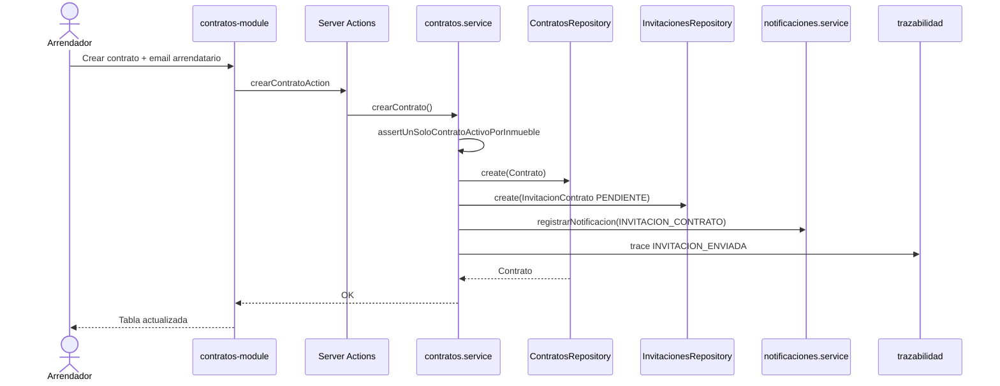

---

## Aceptar contrato

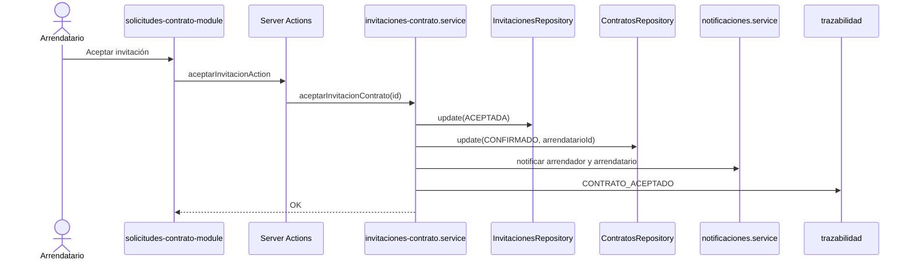

---

## Reportar y validar pago de canon

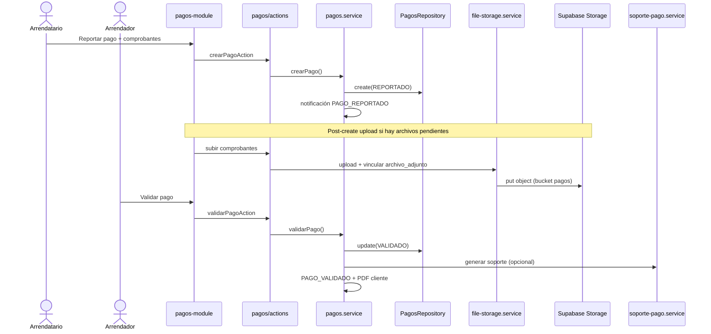

---

## Reportar y validar pago de servicio público

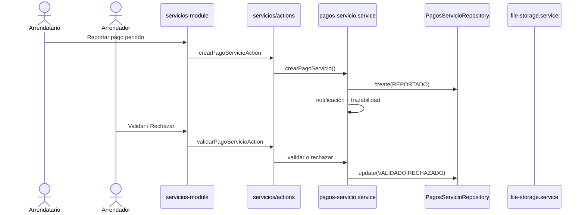

---

## Crear y gestionar mantenimiento

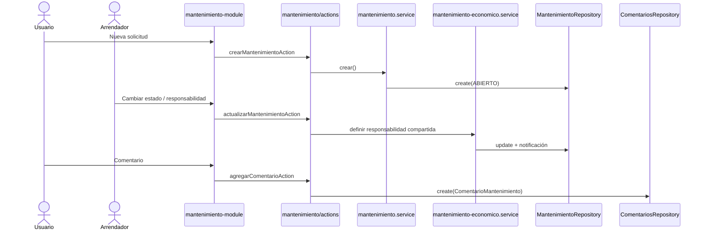

---

## Generar no renovación y registrar envío

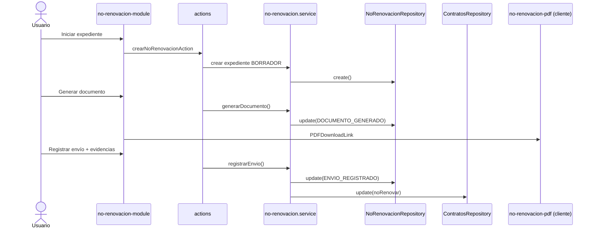

---

## Cargar documento y registrar trazabilidad

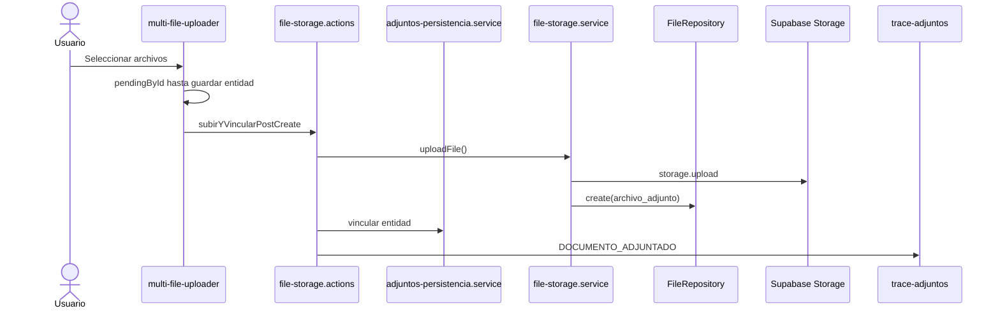

---

## Generar reporte

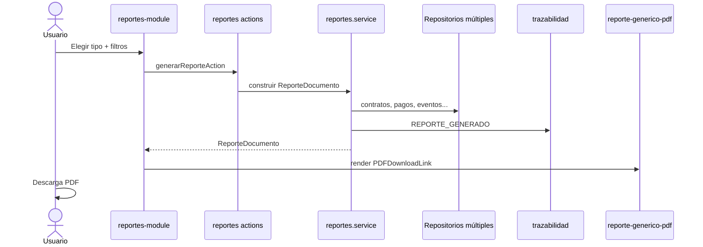

---

## 12. Diagramas de colaboración

Se utilizan **flowcharts** con actores y componentes (Mermaid no ofrece diagrama de colaboración UML clásico de forma estándar).

---

## Proceso: Contrato e invitación

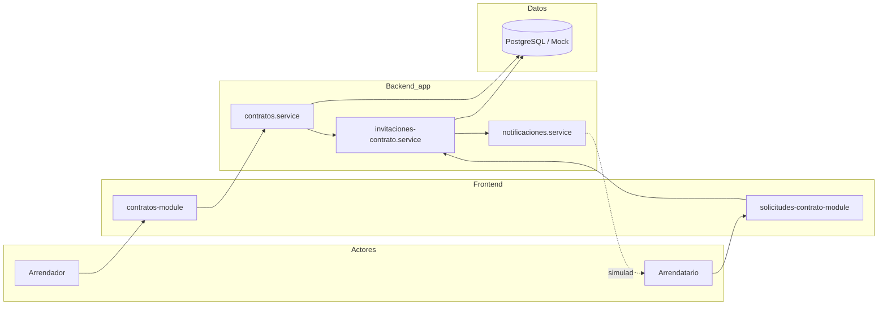

---

## Proceso: Pago de canon

```mermaid
flowchart LR
    AR[Arrendatario] --> PM[pagos-module]
    AD[Arrendador] --> PM
    PM --> PS[pagos.service]
    PS --> PR[pagos.repository]
    PR --> DB[(pagos_canon)]
    PM --> FS[file-storage.service]
    FS --> ST[(Storage pagos)]
    PS --> NS[notificaciones.service]
    PS --> SP[soporte-pago.service]
    SP --> PDF[PDF soporte cliente]
```

---

## Proceso: Servicios públicos

```mermaid
flowchart TB
    AR[Arrendador] --> SM[servicios-module]
    AT[Arrendatario] --> SM
    SM --> SC[servicios-contrato.service]
    SM --> PS[pagos-servicio.service]
    SC --> DB1[(servicios_publicos_contrato)]
    PS --> DB2[(pagos_servicios_publicos)]
    SM --> FS[file-storage.service]
    FS --> ST[(Storage servicios)]
    PS --> AC[access-control.service]
```

---

## Proceso: Mantenimiento

```mermaid
flowchart TB
    U[Usuario] --> MM[mantenimiento-module]
    MM --> MS[mantenimiento.service]
    MM --> ME[mantenimiento-economico.service]
    MS --> MR[mantenimiento.repository]
    MS --> CM[comentarios.repository]
    MR --> DB[(mantenimientos)]
    MM --> FS[file-storage.service]
    FS --> ST[(Storage mantenimiento)]
    MS --> TRZ[trazabilidad.service]
```

---

## Proceso: No renovación

```mermaid
flowchart LR
    U[Arrendador / Arrendatario] --> NR[no-renovacion-module]
    NR --> NRS[no-renovacion.service]
    NRS --> NRR[no-renovacion.repository]
    NRR --> DB[(no_renovaciones)]
    NR --> PDF[no-renovacion-pdf]
    NRS --> CTR[contratos.repository]
    NRS --> FS[file-storage.service]
    FS --> ST[(Storage no-renovacion)]
```

---

## Proceso: Reportes

```mermaid
flowchart TB
    U[Usuario autorizado] --> RM[reportes-module]
    RM --> RS[reportes.service]
    RS --> R1[contratos / pagos / mnt repos]
    RS --> RTS[trazabilidad.service]
    R1 --> DB[(PostgreSQL)]
    RTS --> DB
    RS --> RD[ReporteDocumento DTO]
    RD --> PDF[@react-pdf/renderer]
    PDF --> U
```

## Comunicación entre capas (resumen)

| Origen | Destino | Protocolo |
|--------|---------|-----------|
| Navegador | Next.js App Router | HTTPS |
| Server Actions | Services | Llamada función TS |
| Services | Repositories | Interface TypeScript |
| Repositories Supabase | PostgreSQL | Supabase JS client |
| file-storage.service | Storage | Supabase Storage API |
| Login producción | Firebase Auth | SDK / OAuth |
| Login E2E | `/api/e2e/login` | HTTP POST + cookie |

---

## 13. Diagrama de componentes

```mermaid
flowchart TB
    subgraph Cliente["Cliente"]
        Browser["Navegador web"]
    end

    subgraph NextJS["Next.js App Router"]
        Pages["app/(dashboard)/* pages"]
        Actions["Server Actions<br/>app/**/actions.ts"]
        API["API Route<br/>/api/e2e/login"]
        MW["middleware.ts"]
        Components["components/<br/>modules, shared, ui, pdf"]
    end

    subgraph Logica["Capa de negocio"]
        Services["services/*.service.ts"]
        Access["access-control.service"]
        Audit["lib/audit/*"]
    end

    subgraph Datos["Capa de datos"]
        RepoIndex["repositories/index.ts"]
        Mock["data/mock + repos mock"]
        SupaRepo["repositories/supabase/*"]
    end

    subgraph Externos["Servicios externos"]
        Firebase["Firebase Authentication"]
        PG["Supabase PostgreSQL"]
        Storage["Supabase Storage"]
    end

    subgraph Calidad["Pruebas y reportes"]
        PW["Playwright E2E<br/>tests/e2e"]
        ReactPDF["@react-pdf/renderer<br/>PDF reportes y soportes"]
    end

    Browser --> Pages
    Browser --> Components
    MW --> Pages
    Pages --> Actions
    Pages --> Components
    Components --> Actions
    Actions --> Services
    API --> Services
    Services --> Access
    Services --> Audit
    Services --> RepoIndex
    RepoIndex --> Mock
    RepoIndex --> SupaRepo
    SupaRepo --> PG
    Services --> Storage
    Browser --> Firebase
    Services --> Firebase
    PW --> Browser
    Components --> ReactPDF

    classDef ext fill:#e0e7ff,stroke:#4338ca
    class Firebase,PG,Storage ext
```

---

## 14. Diagrama de distribución

```mermaid
flowchart TB
    subgraph Usuario["Entorno usuario"]
        Browser["Navegador<br/>Chrome / Edge / Firefox"]
    end

    subgraph Hosting["Hosting aplicación"]
        Vercel["Vercel / servidor Node.js<br/>next start o npm run dev"]
        NextApp["Aplicación Next.js 15+<br/>arrendamientos-mvp"]
    end

    subgraph Google["Google Cloud"]
        FirebaseAuth["Firebase Authentication<br/>identidad OAuth/email"]
    end

    subgraph SupabaseCloud["Supabase Cloud"]
        PG["PostgreSQL<br/>esquema relacional"]
        ObjStorage["Object Storage<br/>buckets: contratos, pagos, servicios,<br/>mantenimiento, no-renovacion, evidencias"]
    end

    subgraph DevOps["Desarrollo"]
        GitHub["Repositorio GitHub<br/>3singenieros/alquilaBogota"]
        CI["CI local / laptop<br/>Playwright + MOCK"]
    end

    Browser -->|HTTPS| Vercel
    Vercel --> NextApp
    NextApp -->|SDK Auth| FirebaseAuth
    NextApp -->|Supabase JS| PG
    NextApp -->|Storage API| ObjStorage
    GitHub -->|git clone / push| Vercel
    CI -->|test:e2e localhost:3000| NextApp

    note1["Modo MOCK: datos en memoria<br/>sin PG obligatorio"]
    NextApp -.-> note1
```

---

## 15. Gestión documental

Corresponde al **RF-10**. El MVP permite adjuntar, consultar y descargar documentos de soporte en contratos, pagos, servicios públicos, mantenimiento y no renovación, sin firma digital legal.

### Componentes

| Componente | Ruta / función |
|------------|----------------|
| Carga UI | `components/shared/multi-file-uploader.tsx` |
| Visor | `components/shared/adjuntos-panel.tsx`, `document-viewer.tsx` |
| Server Actions | `app/actions/file-storage.actions.ts`, acciones por módulo (pagos, servicios, mantenimiento) |
| Servicios | `services/file-storage.service.ts`, `services/adjuntos-persistencia.service.ts` |
| Repositorio | `repositories/file.repository.ts`, `repositories/supabase/supabase-file.repository.ts` |
| Metadatos | Tabla `archivo_adjunto`; puentes `contrato_documentos`, `mantenimiento_documentos` |

### Flujo de carga

1. El usuario selecciona archivos en el uploader (estado pendiente en cliente hasta guardar la entidad).
2. Tras crear/actualizar el registro de negocio, se ejecuta **subida post-create** hacia Supabase Storage (modo SUPABASE) o se asigna `urlSimulada` (modo MOCK).
3. Se persisten metadatos (nombre, bucket, path, `entidad_tipo`, `entidad_id`, actor).
4. Se registra trazabilidad `DOCUMENTO_ADJUNTADO` cuando aplica.

### Buckets Storage (modo SUPABASE)

| Bucket | Uso |
|--------|-----|
| `contratos` | Documentos contractuales |
| `pagos` | Comprobantes de canon |
| `servicios` | Comprobantes de servicios públicos |
| `mantenimiento` | Evidencias y documentos de cierre |
| `no-renovacion` | Documento formal y evidencia de envío |
| `evidencias` | Genérico |

Rutas estándar definidas en `lib/supabase/storage-paths.ts`.

> **Implementación parcial:** En MOCK no hay bytes reales en la nube; el visor puede usar URLs simuladas.

---

## 16. Persistencia y almacenamiento

### Modos de operación

| Modo | Variable | Persistencia |
|------|----------|--------------|
| **MOCK** (por defecto) | `NEXT_PUBLIC_APP_MODE=MOCK` | Datos en memoria (`data/mock/`) |
| **SUPABASE** | `NEXT_PUBLIC_APP_MODE=SUPABASE` | PostgreSQL + Storage |

Selector: `config/app-mode.ts`. Fábrica de repositorios: `repositories/index.ts` (función `pick(mock, supabase)`).

### Patrón de acceso a datos

```
Componente React → Server Action → Service → Repository → (Mock | Supabase)
```

Los **Server Components** consumen servicios para listados; los **Client Components** usan Server Actions para mutaciones.

### PostgreSQL

Esquema en `docs/database/supabase-schema.sql`. Entidades alineadas con `types/index.ts`. Soft delete en `usuarios` e `inmuebles` (`deleted_at`).

### Row Level Security

RLS **habilitada** con políticas demo `mvp_demo_*` (acceso permisivo para prototipo). La autorización efectiva del MVP se aplica en **servicios** (`access-control.service.ts`). Para producción: `docs/database/rls-strategy.md`.

### Verificación

- `npm run check:supabase` — conectividad y tablas.
- `npm run check:storage` — buckets y permisos.

---

## 17. Trazabilidad y auditoría

Corresponde al **RF-09** y **RNF-09 / RNF-12**.

### Entidad `EventoTrazabilidad`

| Campo | Descripción |
|-------|-------------|
| `entidadTipo` / `entidadId` | Recurso afectado |
| `contratoId` / `inmuebleId` / `pagoId` | Contexto contractual |
| `accion` | Tipo de evento (`AccionTrazabilidad`) |
| `estadoAnterior` / `estadoNuevo` | Cambios de estado |
| `usuarioId`, `usuarioNombre`, `usuarioEmail`, `usuarioRol` | Actor |
| `valoresAnteriores` / `valoresNuevos` / `metadata` | JSON opcional |

Tabla: `evento_trazabilidad`. Registro **append-only** (inmutable tras creación).

### Tipos de entidad auditables

`CONTRATO`, `INMUEBLE`, `PAGO`, `SERVICIO_PUBLICO`, `PAGO_SERVICIO_PUBLICO`, `MANTENIMIENTO`, `NO_RENOVACION`, `NOTIFICACION`, `USUARIO`, `SOPORTE_PAGO`, `INVITACION_CONTRATO`.

### Acciones representativas

Incluyen: `CREADO`, `ESTADO_CAMBIADO`, `DOCUMENTO_ADJUNTADO`, `INVITACION_ENVIADA`, `CONTRATO_ACEPTADO`, `PAGO_REPORTADO`, `PAGO_VALIDADO`, `MANTENIMIENTO_CREADO`, `NO_RENOVACION_ENVIO_REGISTRADO`, `REPORTE_GENERADO`, `ACCESO_DENEGADO`, `ROL_ACTIVO_CAMBIADO`, entre otras (lista completa en `types/trazabilidad.ts`).

### Servicios y UI

- `services/trazabilidad.service.ts` — consultas filtradas.
- `/trazabilidad` — módulo visible para **ADMIN** y **ARRENDADOR**.
- Helpers: `lib/audit/trace-helper.ts`, `lib/audit/trace-adjuntos.ts`, `lib/audit/actor.ts`.

### Control de visibilidad

`filterTrazabilidadEvents` en `access-control.service.ts`: eventos ligados a contratos/inmuebles accesibles; eventos personales solo si coinciden usuario/email/metadata.

---

## 18. Reportes

Corresponde al **RF-11**.

### Naturaleza

Los reportes se generan **on-demand** como DTO `ReporteDocumento`; **no** existe tabla `reportes` en base de datos. Exportación a PDF en cliente con **`@react-pdf/renderer`** (`components/pdf/reporte-generico-pdf.tsx`, `components/reportes/reporte-download.tsx`).

### Catálogo implementado (`REPORTE_CATALOGO`)

| Tipo | Título | Requisito |
|------|--------|-----------|
| `HISTORIAL_CONTRATO` | Historial completo del contrato | Contrato |
| `HISTORIAL_INMUEBLE` | Historial del inmueble | Inmueble |
| `ESTADO_CUENTA` | Estado de cuenta del contrato | Contrato |
| `PAGOS_CANON` | Reporte de pagos del canon | Contrato |
| `SERVICIOS_PUBLICOS` | Servicios públicos | Contrato |
| `MANTENIMIENTO` | Reporte de mantenimiento | Inmueble |
| `NO_RENOVACION` | Reporte de no renovación | Contrato |
| `TRAZABILIDAD_GLOBAL` | Trazabilidad global | Filtros |
| `CONTRATOS_VENCER` | Contratos próximos a vencer | — |
| `CARTERA_BASICA` | Cartera básica / pendientes | — |

### Contenido del documento

Secciones tabulares, resumen, eventos de trazabilidad filtrados, adjuntos relacionados y bloques de firma simulada (`FirmaReporte`). Servicio: `services/reportes.service.ts`. Ruta: `/reportes`. Evento de auditoría: `REPORTE_GENERADO`.

### Otros PDF del sistema

| Documento | Componente |
|-----------|------------|
| Soporte de pago validado | `components/pdf/soporte-pago-pdf.tsx` |
| Comunicación de no renovación | `components/pdf/no-renovacion-pdf.tsx` |

---

## 19. Evidencias y pruebas E2E

Documentación de las pruebas automatizadas existentes en el repositorio. Fuente: `playwright.config.ts`, `tests/e2e/`, `docs/PRUEBAS_E2E.md`.

---

## Resumen cuantitativo

| Proyecto Playwright | Archivo | Cantidad de pruebas |
|---------------------|---------|---------------------|
| `setup` | `auth.setup.ts` | 1 |
| `login` | `login.spec.ts` | 2 |
| `e2e` | `flows.spec.ts` | 11 |
| `evidencias` | `mvp-evidencias-tesis.spec.ts` | 11 |
| **Total** | | **25** |

Configuración: un worker (`workers: 1`), timeout global 90s (evidencias 20s por test), Chromium Desktop, servidor `npm run dev` con `E2E_MODE` y `NEXT_PUBLIC_APP_MODE=MOCK`.

---

## Rutas y módulos probados

| Prueba (flows / evidencias) | Ruta | `data-testid` página |
|----------------------------|------|----------------------|
| Dashboard | `/` | `page-dashboard` |
| Inmuebles | `/inmuebles` | `page-inmuebles` |
| Contratos | `/contratos` | `page-contratos` |
| Solicitudes contrato | `/solicitudes-contrato` | `page-solicitudes-contrato` |
| Pagos reportados | `/pagos` | `page-pagos` |
| Servicios públicos | `/servicios` | `page-servicios` |
| Mantenimiento | `/mantenimiento` | `page-mantenimiento` |
| No renovación | `/no-renovacion` | `page-no-renovacion` |
| Trazabilidad | `/trazabilidad` | `page-trazabilidad` |
| Reportes | `/reportes` | `page-reportes` |
| Login | `/login` | `page-login` |
| Visor documentos | `/pagos` (modal) | `ver-adjuntos-button`, `document-viewer-close` |

Navegación lateral: `nav-dashboard`, `nav-pagos`, etc.

---

## Autenticación en pruebas

- Setup guarda sesión ADMIN en `playwright/.auth/admin.json`.
- Helper `loginE2eSession` usa `page.request.post` a `/api/e2e/login` (comparte cookies con el browser context).
- Botones: `e2e-login-admin`, `e2e-login-arrendador`, `e2e-login-arrendatario`.

Perfiles demo alineados con `data/mock/seed-profiles.ts` / seed SQL.

---

## Capturas para tesis

Tras `npm run test:e2e`, el proyecto **evidencias** genera PNG nombrados en:

```
test-results/evidencias/
  01-login.png
  02-dashboard.png
  03-inmuebles.png
  04-contratos.png
  04b-solicitudes-contrato.png   (si el menú está visible para ADMIN)
  05-pagos.png
  06-servicios.png
  07-mantenimiento.png
  08-no-renovacion.png
  09-trazabilidad.png
  10-reportes.png
  11-visor-documentos.png
```

Playwright también guarda screenshots por test bajo `test-results/` y **video** en fallos (`retain-on-failure`).

---

## Reporte HTML Playwright

| Elemento | Ubicación / comando |
|----------|---------------------|
| Carpeta reporte | `playwright-report/` |
| Generación | Automática al finalizar `npm run test:e2e` |
| Visualización | `npm run test:e2e:report` o `npx playwright show-report` |

Incluye: estado pass/fail, duración, screenshots adjuntos, traza en primer reintento (`trace: on-first-retry`).

---

## Scripts npm

| Script | Función |
|--------|---------|
| `npm run test:e2e` | Suite completa + levanta dev server |
| `npm run test:e2e:ui` | Modo UI interactivo |
| `npm run test:e2e:report` | Abre último reporte HTML |

---

## Historial de correcciones relevantes

| Problema | Solución aplicada |
|----------|-------------------|
| Setup timeout en dashboard | `loginE2eSession` con `page.request` en lugar de `request` aislado de Playwright |
| Test evidencias colgado | División en 11 tests independientes + `safeScreenshot` |
| 24/25 tests pasando | Visor documentos: `data-testid="document-viewer-close"` en footer del modal (dos botones “Cerrar”) |
| SSR y PDF | `SoportePagoDownload` con `dynamic(..., { ssr: false })` para evitar error 500 |

Estado documentado al generar este manual: suite **25/25** en configuración estándar MOCK + E2E.

---

## Limitaciones de las pruebas E2E

- No sustituyen pruebas unitarias exhaustivas de servicios.
- Validan **carga de pantallas** y flujos UI críticos, no todos los caminos de negocio (p. ej. cada transición de estado).
- Modo MOCK: no verifican persistencia real en Supabase Storage (probar manualmente con `SUPABASE` + seed).
- Visor de documentos en pagos **depende** de que existan comprobantes en datos; si no hay, el test puede omitir interacción (ver `docs/PRUEBAS_E2E.md`).

---

## Evidencia sugerida para tesis

1. Capturas `test-results/evidencias/*.png`.
2. Pantallazo o export del reporte HTML Playwright.
3. Tabla de requerimientos RF con referencia a pruebas (véase `requerimientos-funcionales.md`).
4. Opcional: video de fallo si se documenta corrección de regresiones.

---

## Referencias

- `docs/PRUEBAS_E2E.md`
- `playwright.config.ts`
- Commit: *Agregar pruebas E2E con Playwright, login demo y capturas de evidencia para la tesis.*


### Anexo visual — Capturas para Notion / PDF

Insertar las imágenes generadas por Playwright (`test-results/evidencias/`) tras ejecutar `npm run test:e2e`:

**[FIGURA 1 – LOGIN]**  
[INSERTAR CAPTURA: 01-login.png]

**[FIGURA 2 – DASHBOARD]**  
[INSERTAR CAPTURA: 02-dashboard.png]

**[FIGURA 3 – INMUEBLES]**  
[INSERTAR CAPTURA: 03-inmuebles.png]

**[FIGURA 4 – CONTRATOS]**  
[INSERTAR CAPTURA: 04-contratos.png]

**[FIGURA 4b – SOLICITUDES DE CONTRATO]** *(si aplica al rol)*  
[INSERTAR CAPTURA: 04b-solicitudes-contrato.png]

**[FIGURA 5 – PAGOS REPORTADOS]**  
[INSERTAR CAPTURA: 05-pagos.png]

**[FIGURA 6 – SERVICIOS PÚBLICOS]**  
[INSERTAR CAPTURA: 06-servicios.png]

**[FIGURA 7 – MANTENIMIENTO]**  
[INSERTAR CAPTURA: 07-mantenimiento.png]

**[FIGURA 8 – NO RENOVACIÓN]**  
[INSERTAR CAPTURA: 08-no-renovacion.png]

**[FIGURA 9 – TRAZABILIDAD]**  
[INSERTAR CAPTURA: 09-trazabilidad.png]

**[FIGURA 10 – REPORTES]**  
[INSERTAR CAPTURA: 10-reportes.png]

**[FIGURA 11 – VISOR DE DOCUMENTOS]**  
[INSERTAR CAPTURA: 11-visor-documentos.png]

**[FIGURA 12 – REPORTE HTML PLAYWRIGHT]** *(opcional)*  
[INSERTAR CAPTURA: playwright-report]

---

## 20. Código fuente en repositorio web

### Código fuente alojado en repositorio web

El código fuente completo del MVP se encuentra en repositorio Git versionado:

**URL del repositorio:** [INSERTAR URL GITHUB]

*(Referencia del proyecto: `https://github.com/3singenieros/alquilaBogota`)*

### Estructura principal del repositorio

| Carpeta | Contenido |
|---------|-----------|
| `app/` | App Router: rutas, layouts, Server Actions |
| `components/` | UI: módulos, layout, PDF, shared |
| `services/` | Lógica de negocio |
| `repositories/` | Acceso a datos (mock + supabase) |
| `types/` | Modelos y enums TypeScript |
| `lib/` | Auth, audit, Supabase, utilidades |
| `data/mock/` | Seed en memoria |
| `docs/` | Documentación técnica y SQL |
| `tests/e2e/` | Pruebas Playwright |
| `config/` | Modo aplicación (MOCK/SUPABASE) |

### Cómo reproducir localmente

```bash
npm install
cp .env.example .env.local
npm run dev
```

Modo Supabase: ejecutar scripts en `docs/database/` y configurar `NEXT_PUBLIC_APP_MODE=SUPABASE`.

Pruebas E2E: `npm run test:e2e` (requiere Chromium: `npx playwright install chromium`).

---

## 21. Conclusiones técnicas

1. **Alcance cumplido:** El MVP implementa los módulos obligatorios del prototipo académico (dashboard, inmuebles, contratos, invitaciones, pagos reportados, servicios públicos, mantenimiento, no renovación, trazabilidad, reportes, usuarios y perfil) con separación clara de capas y tipado alineado al esquema relacional.

2. **Arquitectura:** Monolito Next.js con Server Actions y patrón Services/Repositories facilita la transición MOCK → Supabase sin reescribir la interfaz de usuario.

3. **Seguridad:** Autenticación Firebase + sesión firmada + control de acceso en servicios; RLS en base de datos en modo demo permisivo — **implementación parcial** para entorno productivo.

4. **Gestión documental y trazabilidad:** Storage real (Supabase) o simulación (MOCK) con bitácora de auditoría append-only que soporta demostración de cumplimiento y generación de reportes PDF.

5. **Limitaciones conscientes:** Sin pasarela de pagos, sin firma digital cualificada, notificaciones y correo simulados; invitación `EXPIRADA` sin job automático.

6. **Validación:** Suite Playwright de **25 pruebas** con capturas nombradas para evidencia de tesis; complementa pero no reemplaza pruebas unitarias de reglas de negocio.

7. **Evolución recomendada:** Endurecer RLS, SMTP real, pruebas de integración contra Supabase, y despliegue continuo desde el repositorio web documentado en la sección 20.

---

*Fin del Manual Técnico Consolidado — AlquilaBogotá MVP*
