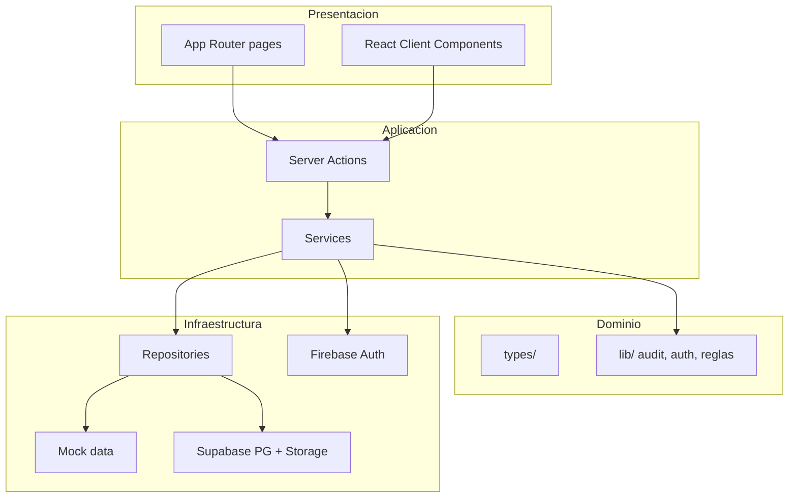

# Arquitectura general — AlquilaBogotá MVP

Prototipo académico para gestión de **arrendamientos ya activos** (no marketplace). Monolito Next.js con persistencia intercambiable MOCK/Supabase.

---

## Vista por capas



---

## Frontend

| Elemento | Implementación |
|----------|----------------|
| Framework | **Next.js** App Router (`app/`) |
| UI | **React** + **Tailwind CSS** |
| Patrón UI | Server Components para páginas; Client Components para modales, tablas interactivas, PDF |
| Rutas protegidas | `app/(dashboard)/` con layout sidebar + topbar |
| Rutas públicas | `/login`, `/onboarding`; API E2E `/api/e2e/login` |

Los componentes de módulo (`components/modules/*-module.tsx`) **no** importan repositorios; delegan en Server Actions.

---

## Backend ligero

No hay servidor Express separado. La lógica vive en:

- **`services/*.service.ts`** — reglas de negocio, autorización, trazabilidad, notificaciones.
- **`app/**/actions.ts`** — frontera del servidor; validación mínima y llamada a servicios.
- **`middleware.ts`** — cookie de sesión, redirecciones, `canAccessPath` por rol activo.

---

## Autenticación

| Modo | Descripción |
|------|-------------|
| **Producción / desarrollo normal** | **Firebase Authentication**; perfil en `profiles`; sincronización a `usuarios`. |
| **Pruebas E2E** | `E2E_MODE` + `POST /api/e2e/login` con perfiles demo (sin Google). |

Sesión de aplicación: cookie firmada (`lib/auth/session-token.ts`) con `rolActivo` y flags de onboarding.

---

## Persistencia

| Modo | Variable | Comportamiento |
|------|----------|----------------|
| **MOCK** (default) | `NEXT_PUBLIC_APP_MODE=MOCK` | Datos en memoria desde `data/mock/` |
| **SUPABASE** | `NEXT_PUBLIC_APP_MODE=SUPABASE` | PostgreSQL + Storage vía cliente Supabase |

Selector en `config/app-mode.ts`; fábrica en `repositories/index.ts` (`pick(mock, supabase)`).

---

## Archivos

- **Supabase Storage** con buckets por módulo (`lib/supabase/storage-paths.ts`).
- Metadatos en tabla `archivo_adjunto`.
- Servicios: `file-storage.service.ts`, `adjuntos-persistencia.service.ts`.
- En MOCK: `urlSimulada` sin bytes en la nube.

---

## Reportes PDF

- Librería **`@react-pdf/renderer`** (v4.x).
- Componentes en `components/pdf/` (reporte genérico, soporte de pago, no renovación).
- Descarga en cliente vía `PDFDownloadLink` (SSR deshabilitado donde aplica, p. ej. `dynamic(..., { ssr: false })`).

Los reportes agregan datos de múltiples repositorios y eventos de trazabilidad; **no** hay tabla `reportes` en BD.

---

## Pruebas

| Herramienta | Alcance |
|-------------|---------|
| **Playwright** | E2E en `tests/e2e/`; 25 pruebas (setup + login + flows + evidencias) |
| Config | `playwright.config.ts`; modo MOCK + E2E en `webServer` |

Detalle: `evidencias-pruebas.md` y `docs/PRUEBAS_E2E.md`.

---

## Patrón Services / Repositories

```
Component → Server Action → Service → Repository → (Mock | Supabase)
```

- **Service:** transacciones lógicas, permisos (`assertModuleAccess`, `access-control`), side effects (notificaciones, trazas).
- **Repository:** CRUD y consultas; implementación dual mock/supabase.

---

## Control de acceso

Doble barrera:

1. **Rutas:** `lib/auth/permissions.ts` + middleware (`rolActivo`).
2. **Datos:** `services/access-control.service.ts` filtra por contrato/inmueble/email.

> En Supabase, RLS actual es **demo permisiva**; la autorización efectiva del MVP está en servicios Node.

---

## Módulos funcionales (rutas)

| Ruta | Servicio principal |
|------|-------------------|
| `/` | `dashboard.service` |
| `/inmuebles` | `inmuebles.service` |
| `/contratos` | `contratos.service` |
| `/solicitudes-contrato` | `invitaciones-contrato.service` |
| `/pagos` | `pagos.service`, `soporte-pago.service` |
| `/servicios` | `servicios-contrato.service`, `pagos-servicio.service` |
| `/mantenimiento` | `mantenimiento.service`, `mantenimiento-economico.service` |
| `/no-renovacion` | `no-renovacion.service` |
| `/notificaciones` | `notificaciones.service` |
| `/trazabilidad` | `trazabilidad.service` |
| `/reportes` | `reportes.service` |
| `/usuarios` | `usuarios.service` |
| `/perfil` | `profile.service` |

---

## Límites del prototipo (arquitectura)

- Sin microservicios ni colas de mensajería.
- Sin procesamiento de pagos reales.
- Sin firma digital cualificada.
- Correo **simulado** (`email.service`, estado notificación `SIMULADA`).

---

## Documentación relacionada

| Documento | Ubicación |
|-----------|-----------|
| Arquitectura previa | `docs/ARQUITECTURA.md` |
| Persistencia | `docs/database/persistence-architecture.md` |
| Control de acceso | `docs/access-control.md` |
| E2E | `docs/PRUEBAS_E2E.md` |
