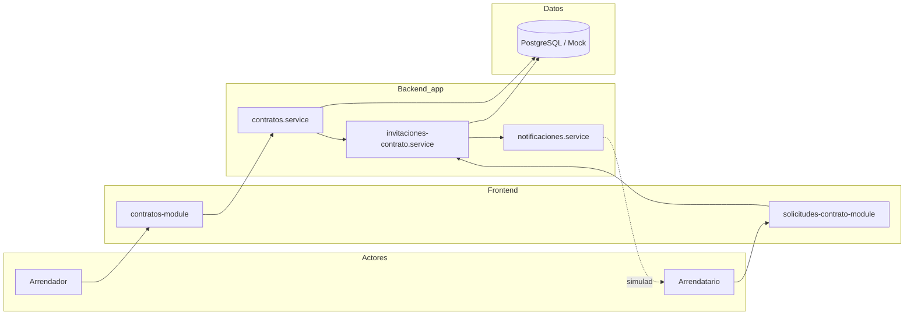
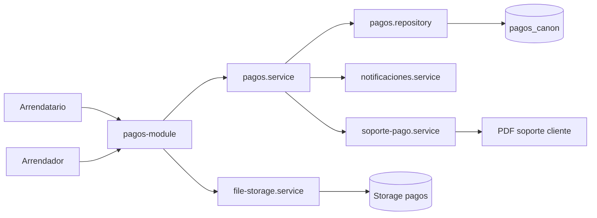
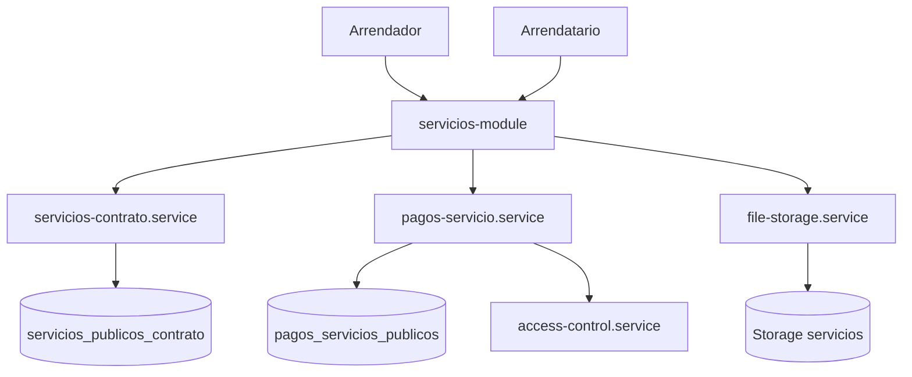
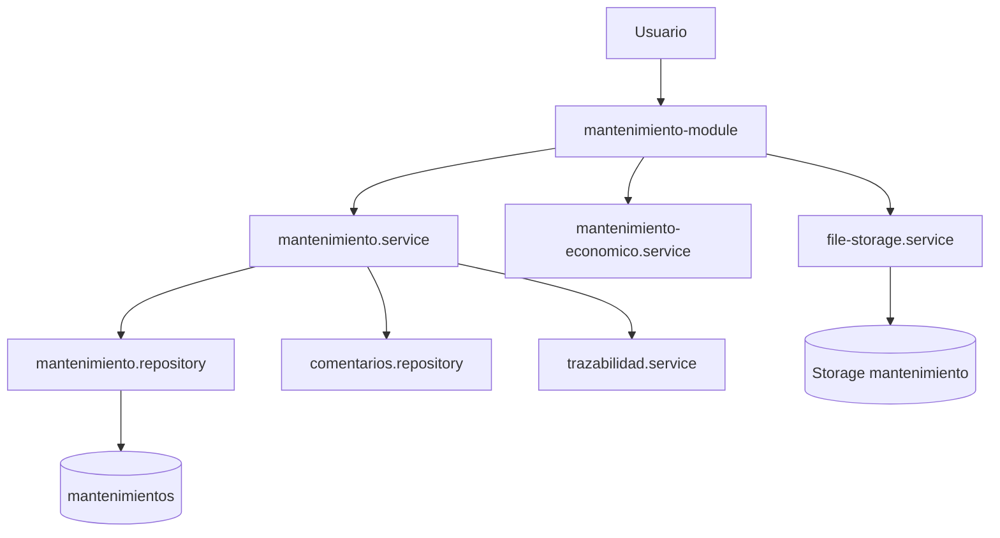
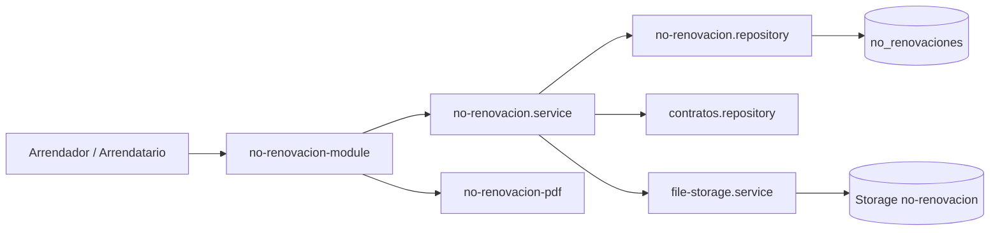

# Diagramas de colaboración / comunicación

Se utilizan **flowcharts** con actores y componentes (Mermaid no ofrece diagrama de colaboración UML clásico de forma estándar).

---

## Proceso: Contrato e invitación



---

## Proceso: Pago de canon



---

## Proceso: Servicios públicos



---

## Proceso: Mantenimiento



---

## Proceso: No renovación



---

## Proceso: Reportes

```mermaid
flowchart TB
    U[Usuario autorizado] --> RM[reportes-module]
    RM --> RS[reportes.service]
    RS --> R1[contratos / pagos / mnt repos]
    RS --> RTS[trazabilidad.service]
    R1 --> DB[(PostgreSQL)]
    RTS --> DB
    RS --> RD[ReporteDocumento DTO]
    RD --> PDF[@react-pdf/renderer]
    PDF --> U
```

## Comunicación entre capas (resumen)

| Origen | Destino | Protocolo |
|--------|---------|-----------|
| Navegador | Next.js App Router | HTTPS |
| Server Actions | Services | Llamada función TS |
| Services | Repositories | Interface TypeScript |
| Repositories Supabase | PostgreSQL | Supabase JS client |
| file-storage.service | Storage | Supabase Storage API |
| Login producción | Firebase Auth | SDK / OAuth |
| Login E2E | `/api/e2e/login` | HTTP POST + cookie |
