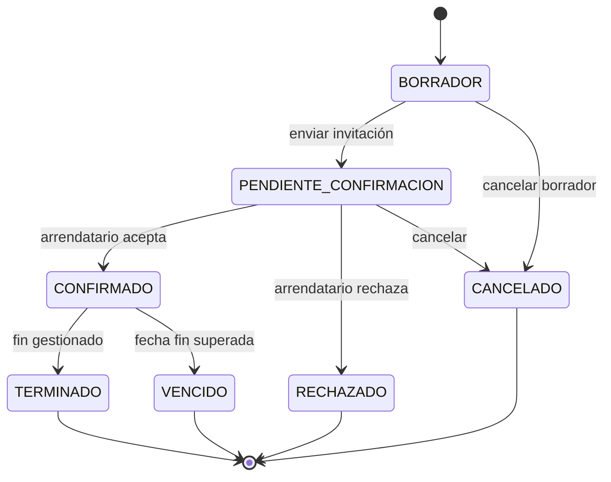
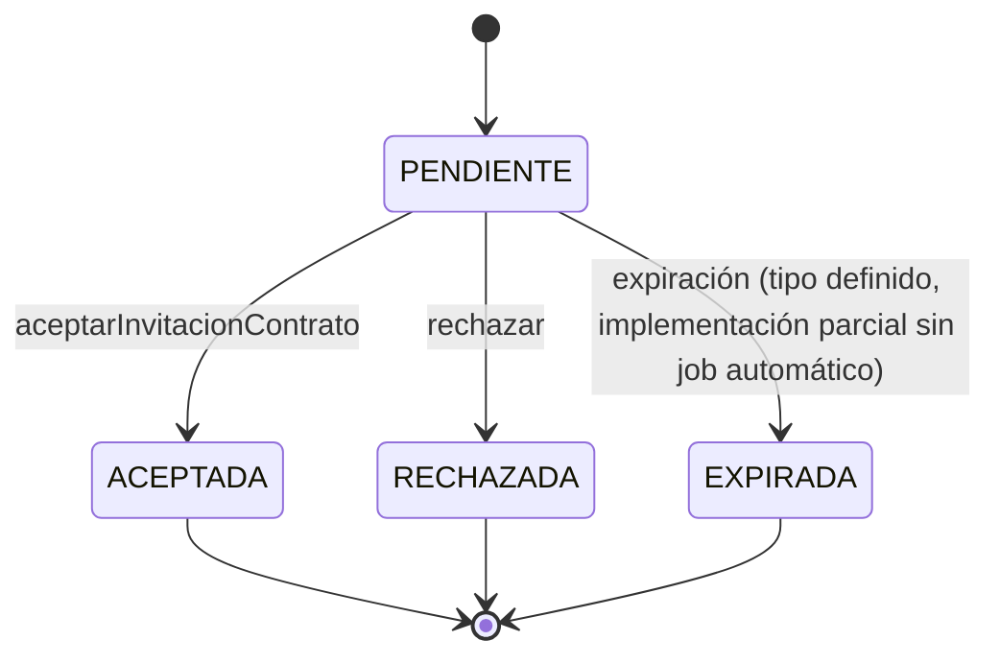
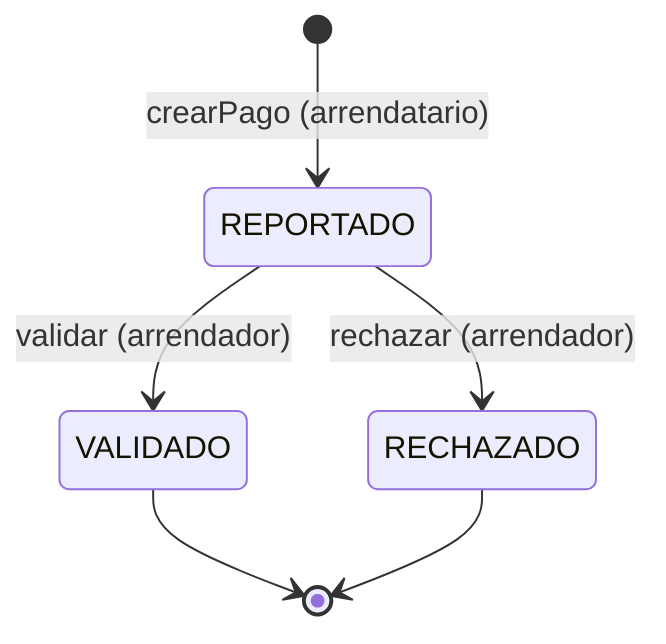
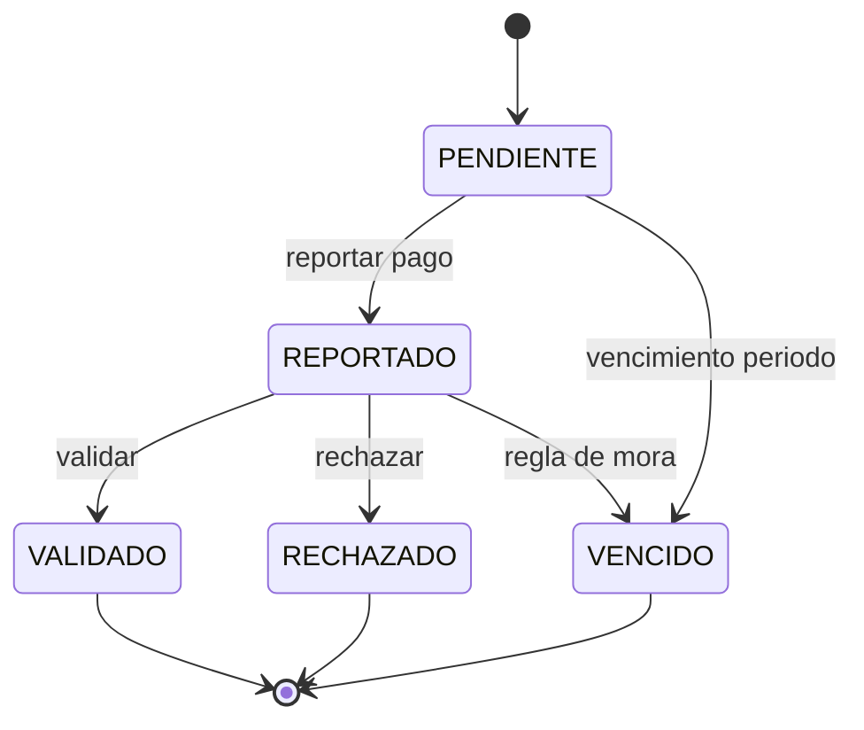
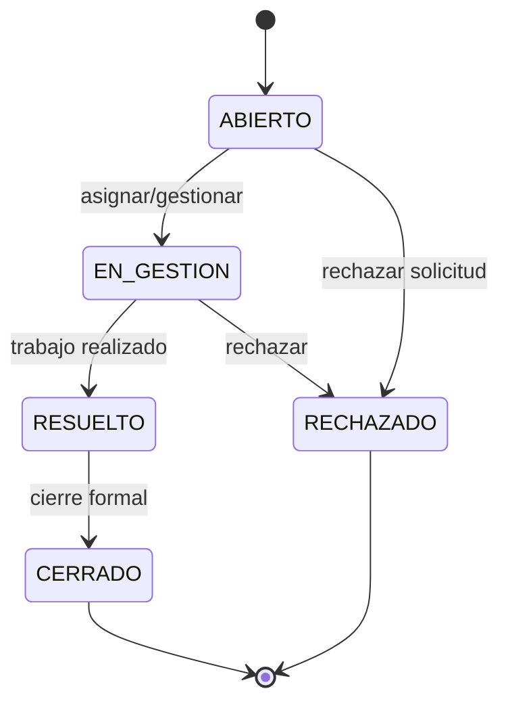
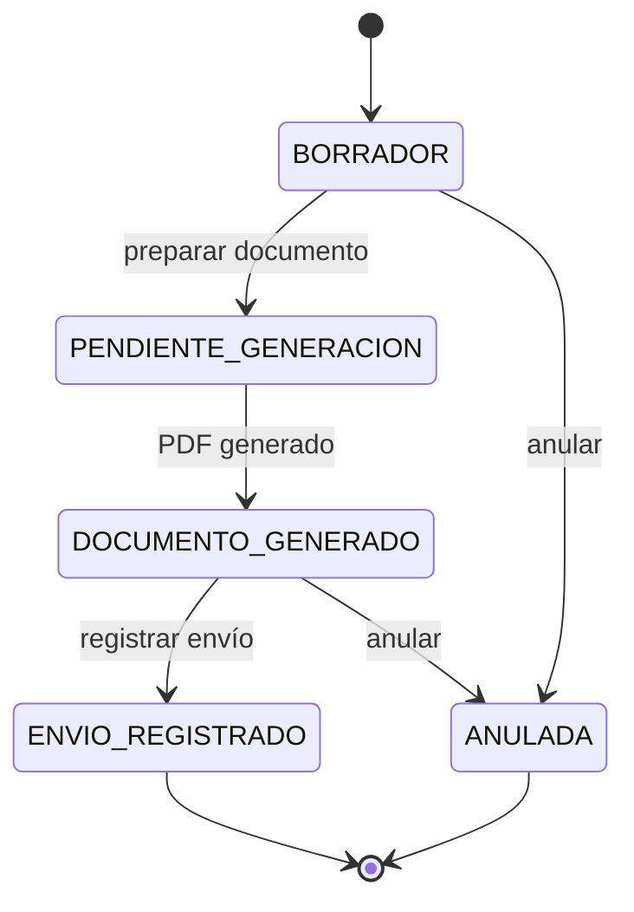
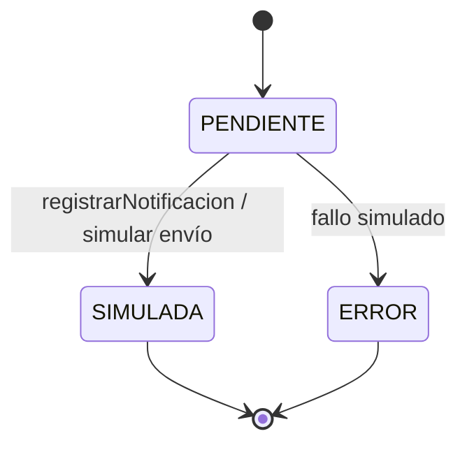
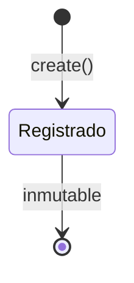

# Diagramas de estado

Estados definidos en `types/index.ts` y enums PostgreSQL en `docs/database/supabase-schema.sql`.

---

## Contrato (`EstadoContrato`)

El contrato gobierna el ciclo de vida del arrendamiento. Transiciones principales vía `contratos.service` e `invitaciones-contrato.service`.

**Explicación:** `BORRADOR` permite editar sin compromiso; `PENDIENTE_CONFIRMACION` espera respuesta de invitación; `CONFIRMADO` habilita pagos y servicios. Estados terminales cierran el ciclo operativo.

---

## Invitación de contrato (`EstadoInvitacionContrato`)

**Explicación:** Una invitación pendiente bloquea la confirmación hasta respuesta del arrendatario con email coincidente.

---

## Pago de canon (`EstadoPago` / `PagoReportado`)

**Explicación:** No existe pasarela de pago; `REPORTADO` indica declaración del arrendatario; el arrendador certifica con `VALIDADO` y puede emitir `SoportePago` PDF.

---

## Pago de servicio público (`EstadoPagoServicioPublico`)

**Explicación:** Incluye estado inicial `PENDIENTE` antes del reporte del arrendatario; `VENCIDO` alerta mora en servicios.

---

## Mantenimiento (`EstadoMantenimiento`)

**Explicación:** Paralelamente puede existir subestado de **aceptación de responsabilidad** (`AceptacionResponsabilidadMantenimiento`: PENDIENTE, ACEPTADA, RECHAZADA) para reparto de costos.

---

## No renovación (`EstadoNoRenovacion`)

**Explicación:** El expediente acumula adjuntos de documento y de envío; el contrato puede marcarse `noRenovar` en paralelo.

**Envío (`EstadoEnvioNoRenovacion`):** `PENDIENTE` → `REGISTRADO` (o `ERROR` en fallos simulados).

---

## Notificación (`EstadoNotificacion`)

**Explicación:** Las notificaciones no salen por SMTP real en el MVP; `SIMULADA` documenta el acto para la demo.

---

## Evento de trazabilidad

Los eventos **no cambian de estado**; son registros append-only. Se modelan como:

**Explicación:** La “transición” es la creación del evento con `accion`, `estadoAnterior` y `estadoNuevo` opcionales reflejando cambios en otras entidades.
