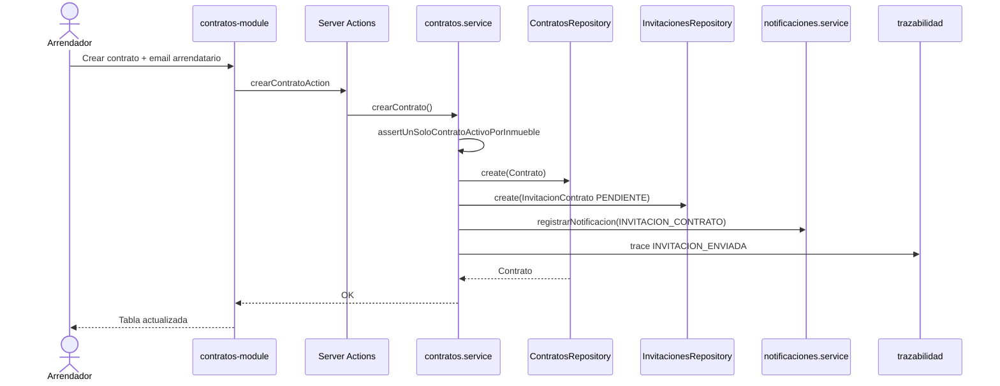
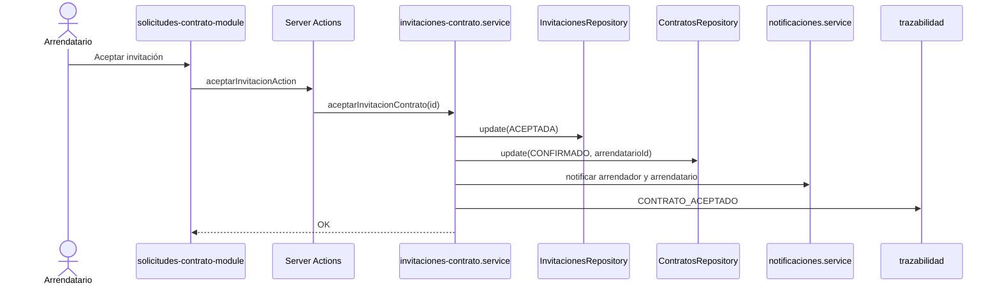
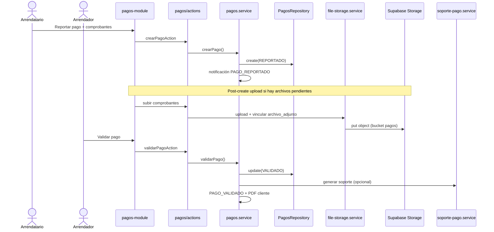
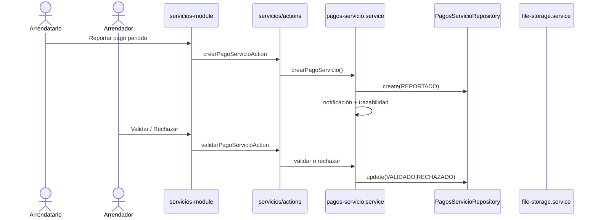
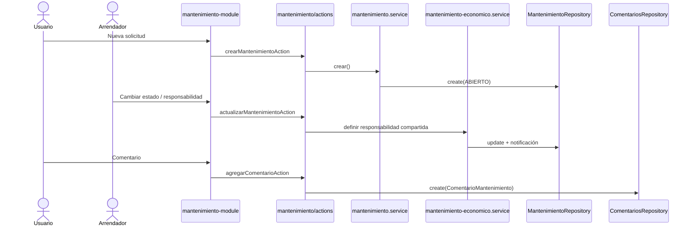
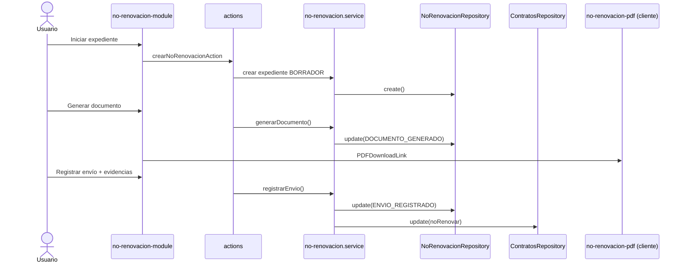
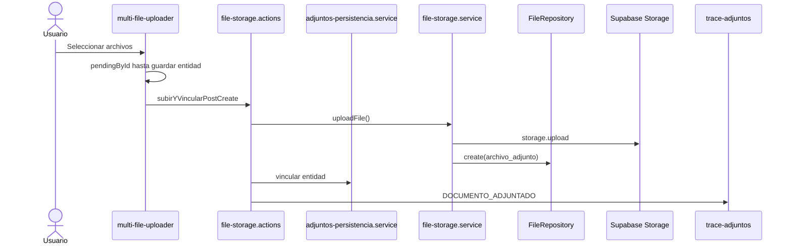
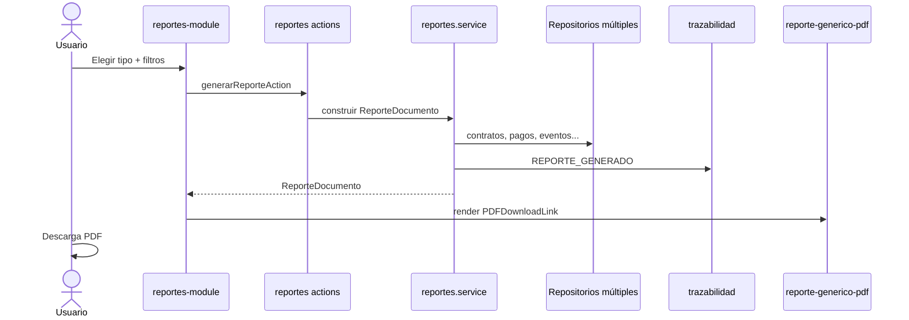

# Diagramas de secuencia

Interacción entre UI (Next.js), Server Actions, servicios, repositorios y servicios externos. Patrón común: **no acceso directo a datos desde componentes**.

---

## Crear contrato e invitar arrendatario

---

## Aceptar contrato

---

## Reportar y validar pago de canon

---

## Reportar y validar pago de servicio público

---

## Crear y gestionar mantenimiento

---

## Generar no renovación y registrar envío

---

## Cargar documento y registrar trazabilidad

---

## Generar reporte

