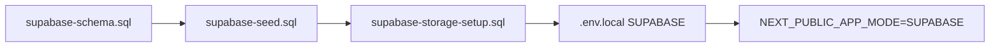

# Scripts de base de datos — referencia

El MVP centraliza los scripts SQL en `docs/database/`. No ejecutar en producción sin revisar credenciales y políticas RLS.

---

## `docs/database/supabase-schema.sql`

| Aspecto | Detalle |
|---------|---------|
| **Propósito** | Crear el esquema completo en PostgreSQL (Supabase): enums, tablas, índices, triggers `updated_at`, habilitación RLS y políticas demo permisivas. |
| **Cuándo usarlo** | Primera configuración del proyecto Supabase o recreación del modelo en SQL Editor. |
| **Contenido clave** | Tablas `usuarios`, `profiles`, `inmuebles`, `contratos`, pagos, mantenimiento, `no_renovaciones`, `notificaciones`, `evento_trazabilidad`, `archivo_adjunto`; comentario final sobre buckets Storage. |
| **Relación con la app** | Tipos en `types/index.ts` y repositorios `repositories/supabase/*` mapean columnas snake_case ↔ camelCase. |

**Orden recomendado:** ejecutar este archivo antes que seed y storage setup.

---

## `docs/database/supabase-seed.sql`

| Aspecto | Detalle |
|---------|---------|
| **Propósito** | Poblar datos de demostración académica (usuarios, inmuebles, contratos, pagos, etc.) coherentes con `data/mock/seed.ts`. |
| **Cuándo usarlo** | Tras el schema, para tener dataset visible en modo `NEXT_PUBLIC_APP_MODE=SUPABASE`. |
| **Precaución** | Solo entornos de desarrollo/demo; puede sobrescribir o duplicar si se ejecuta múltiples veces sin limpiar. |

---

## `docs/database/supabase-storage-setup.sql`

| Aspecto | Detalle |
|---------|---------|
| **Propósito** | Documentar y/o ejecutar configuración de **buckets** en Supabase Storage: `contratos`, `pagos`, `servicios`, `mantenimiento`, `no-renovacion`, `evidencias`. |
| **Cuándo usarlo** | Al activar subida real de comprobantes y documentos (`services/file-storage.service.ts`). |
| **Complemento** | `docs/database/storage-buckets.md`, script `npm run check:storage` para verificar conectividad. |

---

## Scripts relacionados (no sustitutos)

| Archivo | Nota |
|---------|------|
| `docs/database/supabase-rls-demo.sql` | Políticas RLS adicionales si el schema ya se aplicó sin la sección final. |
| `supabase/schema.sql` / `supabase/seed.sql` | Copias o enlaces del repo; preferir `docs/database/` como fuente documentada. |
| `data/mock/seed.ts` | Seed en memoria para modo MOCK (no SQL). |

---

## Flujo de configuración típico

1. Crear proyecto en [Supabase](https://supabase.com).
2. Ejecutar **schema** en SQL Editor.
3. Ejecutar **seed** (opcional).
4. Crear buckets según **storage-setup** y políticas de Storage.
5. Configurar variables en `.env.local` (ver `.env.example`).
6. Cambiar modo de app a SUPABASE y reiniciar Next.js.

---

## Verificación

- `npm run check:supabase` — conectividad y tablas.
- `npm run check:storage` — buckets y permisos de subida.

Documentación ampliada: `docs/database/CONEXION_SUPABASE.md`, `docs/database/persistence-architecture.md`.
